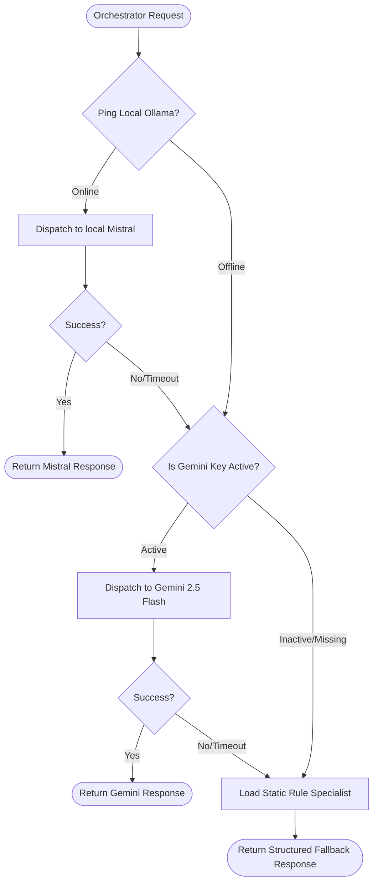

# 🧠 model_flow: Model Routing & Fallback Chain

This document describes how the `ModelRouter` manages model orchestration, privacy limits, and graceful fallbacks inside `ai-service-v2`.

---

## 1. Flow Diagram

---

## 2. Fallback Chain Descriptions

### Primary Layer: Local Mistral (via Ollama)
* **Goal**: Guarantees complete data privacy and offline operational readiness.
* **Mechanism**: Pings local Ollama service (`/api/tags`) to verify availability. Dispatches synchronous or streaming POST requests to `/api/chat` using `mistral`.
* **Latency**: 1-3 seconds depending on hardware acceleration.

### Secondary Layer: Google Gemini API
* **Goal**: High-speed, high-reasoning fallback if local resources are offline or under heavy load.
* **Mechanism**: Verifies presence of `GEMINI_API_KEY`. Dispatches structured requests to `gemini-2.5-flash` with dynamic system instructions and formatting controls.
* **Latency**: 800ms - 1.5s.

### Tertiary Layer: Local Static Specialist
* **Goal**: Unconditional operational guarantee.
* **Mechanism**: Algorithmic fallbacks that construct responses by directly mapping planned meal lists, calories targets, allergy block tags, and active condition filters to high-fidelity warm templates. No model tokens are consumed.
* **Latency**: < 10ms.
