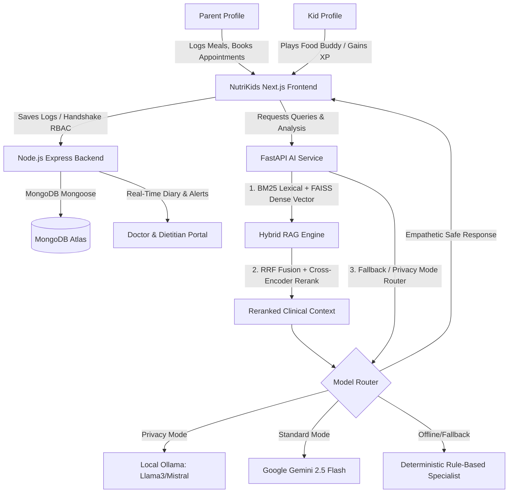
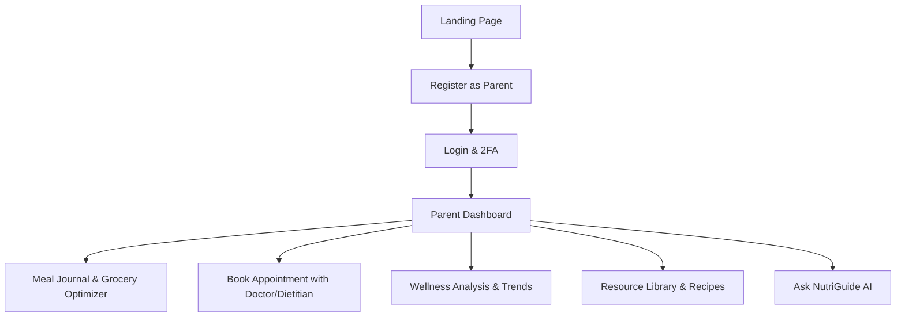
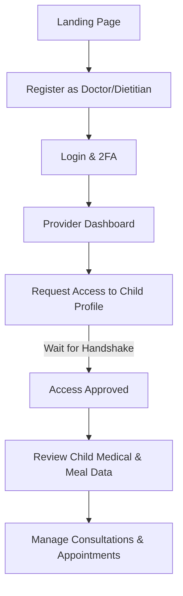

# 🥦 NutriKids: Product Specification Document
## AI-Powered Pediatric Nutrition Intelligence Platform
### Document Reference: `project-spec_18thJune.md`
**Date of Document**: June 18, 2026 (Updated with New Features)
**Audience**: Faculty Evaluators, Internship Reviewers, Project Guides, Non-technical Stakeholders, Onboarding Developers

---

## 1. PRODUCT OVERVIEW

### 🌟 Product Vision
NutriKids is a clinical-grade pediatric nutrition intelligence platform designed to bridge the structural feedback loops between parents, children, pediatricians, and dietitians. By transforming static nutritional guidelines into a dynamic, safe, RAG-enriched decision engine, NutriKids empowers families with clinically validated dietary planning, gamified kid engagement, and direct medical oversight. 

### 🎯 Product Objectives
* **Response Latency**: Deliver a high-performance web experience achieving $< 200\text{ms}$ response times for transactional routes and $< 1.5\text{s}$ for RAG generation.
* **Clinical Integrity**: Enforce absolute nutritional safety by blocking allergen-linked or illness-restricted foods using deterministic preprocessing filters.
* **Habit Formation**: Drive kid engagement via a gamified companion avatar ("Food Buddy") that awards XP, levels, and badges.
* **Collaborative Care**: Securely connect parents, pediatricians, and dietitians using a granular authorization handshake and appointment booking system.
* **Privacy Controls**: Establish high-grade trust with a parent-toggleable local offline inference model (Privacy Mode).
* **AI-Driven Planning**: Offer automated Meal Planning and Grocery Optimization engines to reduce parental cognitive load.

### 👥 Stakeholders
1. **Faculty Evaluators & Project Guides**: Require academic-grade architectural documentation, clean design pattern validation, and testable codebases.
2. **Internship Reviewers**: Seek enterprise-quality code patterns, standard API specifications, database design integrity, and solid security paradigms.
3. **Parents & Children**: Require clean user journeys, vibrant aesthetics, interactive feedback loop, and immediate health/safety assurance.
4. **Pediatricians & Dietitians**: Need accurate, longitudinal patient records, rapid growth data analysis, automated risk triage, and clean prescription tools.
5. **Developers**: Need a modular, documented codebase with clean interfaces, containerized staging setups, and straightforward local environment scripts.

### 👥 User Roles
* **Parent**: Administrative supervisor of child profiles. Can log dietary data, manage doctor/dietitian link requests, book appointments, view wellness analytics, and toggle security settings.
* **Doctor**: Healthcare provider. Can request read-only access to child records, configure diagnostic notes, generate clinical prescriptions, and review risk escalations.
* **Dietitian**: Nutrition specialist. Can review meal logs, provide tailored meal plans, manage consultations, and analyze long-term nutritional trends.
* **Child (Kids Mode)**: End-user companion mode. Can interact with the "Food Buddy" mascot, earn XP points, review quests, and unlock badge rewards.

---

## 2. USER ROLES

| Parameter | Parent Role | Doctor Role | Dietitian Role | Child Role (Kids Mode) |
| :--- | :--- | :--- | :--- | :--- |
| **Purpose** | Oversee clinical logs, review analytics, book appointments. | Monitor growth, write prescriptions, handle escalations. | Review meal logs, create specialized diets, handle nutrition consults. | Log child-friendly meal choices, converse with Food Buddy, level up XP. |
| **Permissions** | Write, Edit, Delete own profile and nested child profile records. | Read approved patient profile records. Write prescriptions and notes. | Read approved patient meal/health logs. Write diet plans. | Read own stats. Write chat messages to Food Buddy. |
| **Accessible Pages** | Parent Dashboard, Child Profile, Meal Log, AI Chat, Doctor Access, Appointments, Resource Library, Wellness Analysis. | Doctor Dashboard, Patient Details, Clinical Notes, Escalation Inbox. | Dietitian Dashboard, Case Detail, Patient Profile, Consultations. | Food Buddy Chat, XP dashboard, Rewards and Badges screen. |
| **Actions Allowed** | Log meals; Book appointments; Invite doctors/dietitians; Generate Grocery Lists; Toggle privacy mode. | Issue prescriptions; Resolve escalation flags; Monitor BMI curves. | Analyze nutrition trends; Manage cases; Prescribe meal plans. | Chat with superhero mascot; Earn XP; Unlock badges. |

---

## 3. AUTHENTICATION FLOW

NutriKids implements a stateless authentication workflow leveraging high-entropy JSON Web Tokens (JWT) stored in HTTP-only cookies, augmented with Two-Factor Authentication (2FA) and password recovery.

### 🛠️ Authentication Screens & Endpoints

#### A. Registration Page (`POST /api/auth/register`)
* **Purpose**: Create a new platform identity for a Parent, Doctor, or Dietitian.
* **Fields**: Name, Email, Password, Role (`parent` \| `doctor` \| `dietitian`), Title, Phone.
* **Validations**: Zod validated schemas. Email structure, password minimum length (8 chars).

#### B. Login Page (`POST /api/auth/login`)
* **Purpose**: Authenticate credentials and establish an active session.
* **Success Flow**: Checks password validity using `bcrypt.compare`. If 2FA is enabled, triggers 2FA verification flow. Generates HMAC-SHA256 JWT, signs payload containing user ID and role, returns HTTP 200.

#### C. 2FA & Password Recovery
* **`POST /api/auth/verify-2fa`**: Verifies 2FA token sent via Email/SMS.
* **`POST /api/auth/forgot-password` & `/api/auth/reset-password`**: Secure password reset flow using short-lived tokens.

---

## 4. COMPLETE USER WORKFLOWS

### 🔄 Parent Journey

### 🩺 Doctor & 🍏 Dietitian Journey

---

## 5. FEATURE SPECIFICATIONS

### Feature 1: Authentication & Role-Based Access Control (RBAC)
* **API Endpoints**: `/api/auth/register`, `/api/auth/login`, `/api/auth/verify-2fa`, `/api/auth/reset-password`.
* **Workflow**: Enforces 2FA, manages JWTs, restricts routes via `role.middleware.js`.

### Feature 2: Dietitian & Doctor Portals
* **Purpose**: Specialist oversight panels.
* **API Endpoints**: `/api/dietitian/*`, `/api/doctor/*`.
* **Workflow**: Manage cases, prescribe diets, view growth velocity and nutrition trends.

### Feature 3: Appointment Booking & Consultations
* **Purpose**: Schedule video/in-person meetings between parents and specialists.
* **API Endpoints**: `/api/appointment/*`, `/api/consultation/*`.
* **Workflow**: Parents browse directory, select slots, backend maps availability, creates appointment records.

### Feature 4: Grocery Optimizer & Meal Planner Engine
* **Purpose**: AI-driven engines to automate weekly meal planning and generate optimized shopping lists.
* **Workflow**: Evaluates child's nutritional gaps and preferences to auto-generate weekly menus, aggregating ingredients into a smart grocery list.

### Feature 5: Wellness Analysis & Nutrition Trends
* **Purpose**: Long-term graphical analysis of dietary habits.
* **API Endpoints**: `/api/nutritionTrends/*`, `/api/analytics/*`.
* **Workflow**: Aggregates weekly/monthly logs, highlights deficiencies, predicts growth trajectories.

### Feature 6: Hospital & Specialist Directory
* **Purpose**: Geospatial search for nearby healthcare providers.
* **API Endpoints**: `/api/hospital/*`.
* **Workflow**: Uses MongoDB Spatial Indexing to find closest registered clinics/doctors based on user location.

### Feature 7: AI Nutrition Assistant (NutriGuide Chat)
* **Purpose**: Conversational pediatric advisor using Hybrid RAG Engine.

### Feature 8: Food Buddy Mascot & Kids Mode
* **Purpose**: Child-friendly gamified dashboard awarding XP and badges.

### Feature 9: Escalation System & Notifications
* **Purpose**: Pediatric warning triage dashboard and system alerts.
* **Workflow**: Uses `sms.service.js` and `email.service.js` to alert doctors of high-risk symptoms or parents of upcoming appointments.

### Feature 10: Privacy Mode
* **Purpose**: Local-first LLM inference toggle diverting queries to local Ollama.

---

## 6. DATABASE DOCUMENTATION

#### 1. `Users` Collection
* **Roles Added**: Enum includes `parent`, `doctor`, `dietitian`. Includes subdocuments for `doctorProfile` and `dietitianProfile`.

#### 2. `Appointments` Collection
* **Purpose**: Manages scheduled consultations.
* **Fields**: `patientId`, `providerId`, `slotTime`, `status`, `type` (video/in-person).

#### 3. `Hospitals` Collection
* **Purpose**: External directory mapping.
* **Fields**: `name`, `location` (GeoJSON Point), `contactInfo`.

#### 4. `MealLogs` & `GrowthRecords` Collections
* Inherited core functionalities tracking daily slots and velocity metrics.

---

## 7. API CATALOG

* **`/api/auth`**: `register`, `login`, `me`, `verify-2fa`, `forgot-password`, `reset-password`.
* **`/api/appointment`**: CRUD for scheduling consultations.
* **`/api/hospital`**: Geospatial directory queries.
* **`/api/nutritionTrends`**: Aggregation endpoints for Wellness Analysis charts.
* **`/api/dietitian`**: Case management and patient records for dietitians.
* **`/api/doctor`**: Clinical alerts, patient lists, handshake requests.
* **`/api/meals`**: AI meal planning triggers and standard logging.

---

## 8. AI/ML ARCHITECTURE

NutriKids utilizes a hybrid, multi-stage RAG and fallback chain optimized for medical safety, operational uptime, and low execution latency.
* **Primary**: Google Gemini 2.5 Flash for rapid response.
* **Privacy Toggle**: Local Ollama (Llama3/Mistral) for zero-cloud footprint.
* **Retrieval**: BM25 Lexical + FAISS Dense Vector + Cross-Encoder Reranker.
* **New Engines**: `groceryOptimizerEngine.js` and `mealPlannerEngine.js` utilize LLM structured outputs to map semantic dietary rules into strict JSON schedules.

---

## 9. UI SCREEN DOCUMENTATION

### 🖥️ App Screen Catalog

1. **Parent Dashboard & MyChildren**: Command center for family profiles.
2. **BookAppointment & MyAppointments**: Interfaces for managing specialist consultations.
3. **Directory**: Geospatial map and list of local pediatricians/dietitians.
4. **WellnessAnalysis**: Recharts-powered dashboard showing macro trends.
5. **ResourcesLibrary**: Educational content and `RecipeCard` viewer.
6. **Dietitian Dashboard & CaseDetail**: Portals for dietary specialists to review patient data.
7. **Doctor Dashboard & Handshake Panel**: Clinical oversight and permission management.
8. **AI Chat & Food Buddy**: Conversational RAG portals for parents and gamified versions for kids.

---

## 10. TEAM CONTRIBUTIONS

* **Abhiram**: AI Core orchestration, Model Router, FastAPI deployment, Grocery Optimizer Engine.
* **Tharun**: Express Node backend, Mongoose schemas, Auth logic (2FA), Appointment & Directory services.
* **Dinesh Veera**: Hybrid RAG pipeline, FAISS semantic vector DB, Cross-Encoder reranker.
* **Pavan Krishna**: Food Databases, nutrient calculators, Nutrition Trends Engine, Wellness Analysis logic.
* **Pavan Vignesh**: Next.js App Router UI, Framer Motion transitions, Dietitian dashboards, Resources Library UI.

---

## 11. FUTURE ROADMAP

### 🚀 Phase 1: AI Food Image Recognition
* Enable parents to snap meal photos for Gemini Vision automated calorie logging.
### 📋 Phase 2: Wearable Integration
* Direct Apple Health/Fitbit sync for activity tracking.

---

## 12. TRACEABILITY MATRIX

| Feature ID | Functional Requirement | UI Screen | Connected Express Endpoint | Connected FastAPI / Engine |
| :--- | :--- | :--- | :--- | :--- |
| **F-01** | JWT Auth, 2FA, RBAC | Login/Register | `/api/auth/*` | None |
| **F-02** | Child Profile Mgmt | Profile Config | `/api/profiles` | None |
| **F-03** | Meal & Grocery Planner | Journal / Optimizer | `/api/meals` | `mealPlannerEngine.js` |
| **F-04** | Wellness & Nutrition Trends | Wellness Analysis | `/api/nutritionTrends` | `nutritionIntelligenceEngine` |
| **F-05** | Consultations & Appointments | BookAppointment | `/api/appointment/*` | None |
| **F-06** | Specialist Directory | Directory Screen | `/api/hospital/*` | `spatialIndex.service.js` |
| **F-07** | Dietitian Portal | Dietitian Dashboard | `/api/dietitian/*` | None |
| **F-08** | Hybrid RAG AI Chat | NutriGuide | None | `/ask` |
| **F-09** | Kids Gamification | Food Buddy | `/api/game/*` | None |

---
*End of Specification Document*
