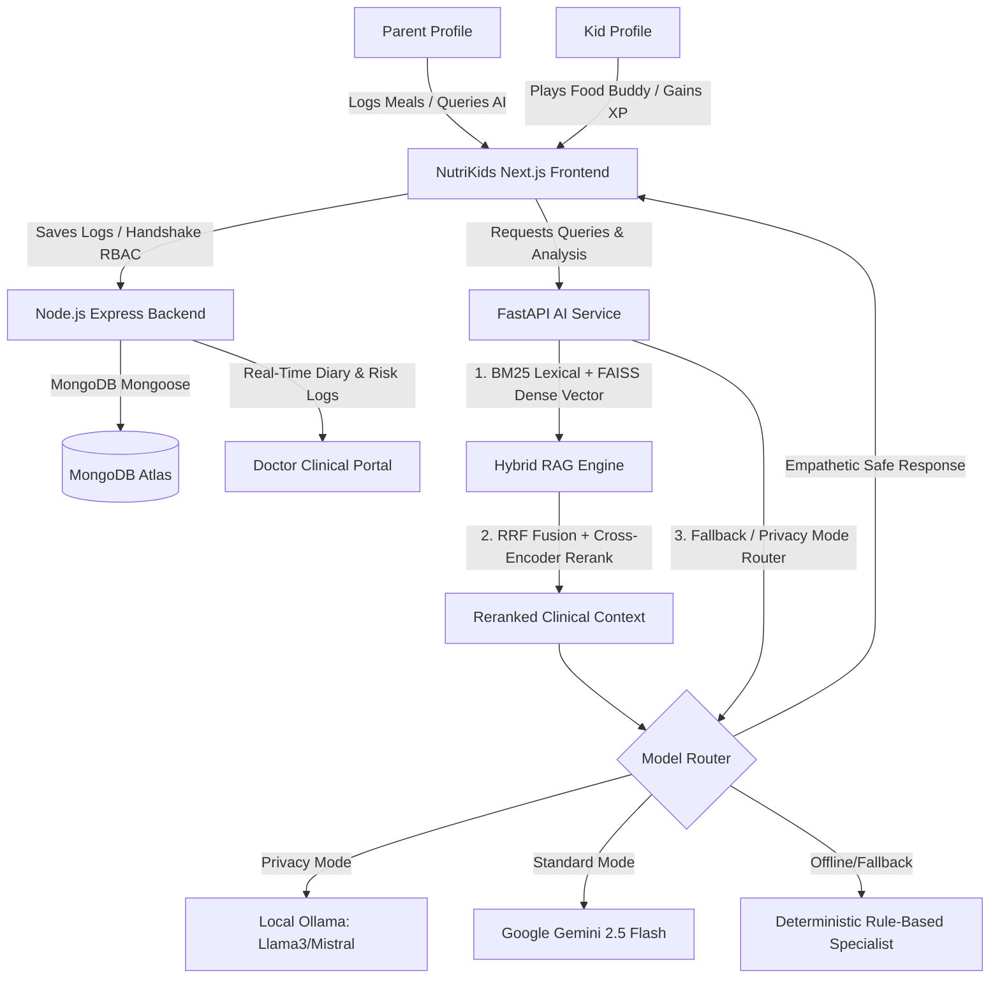
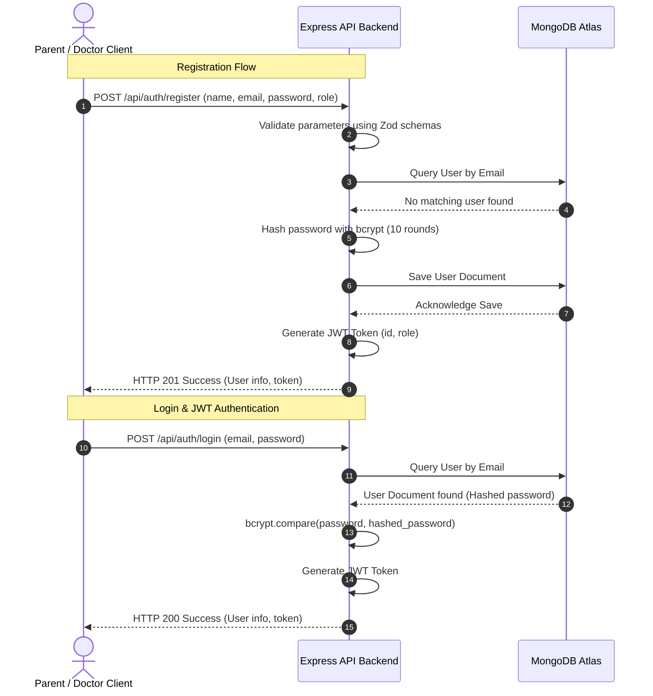
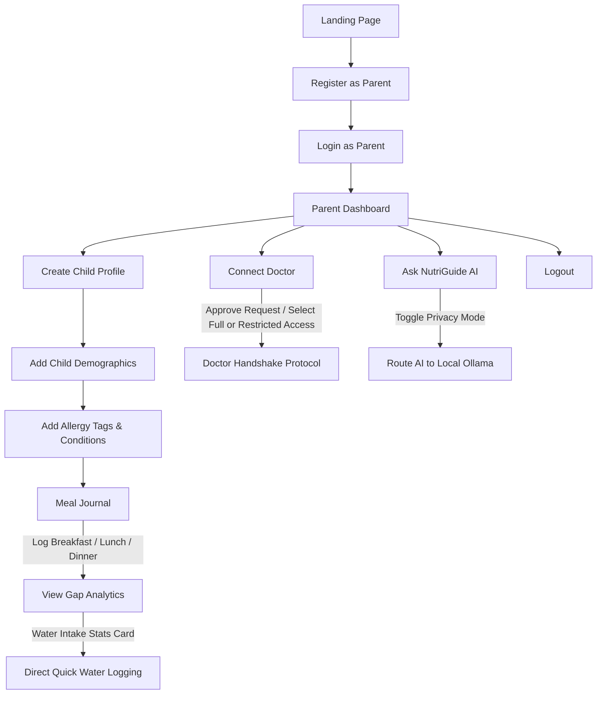
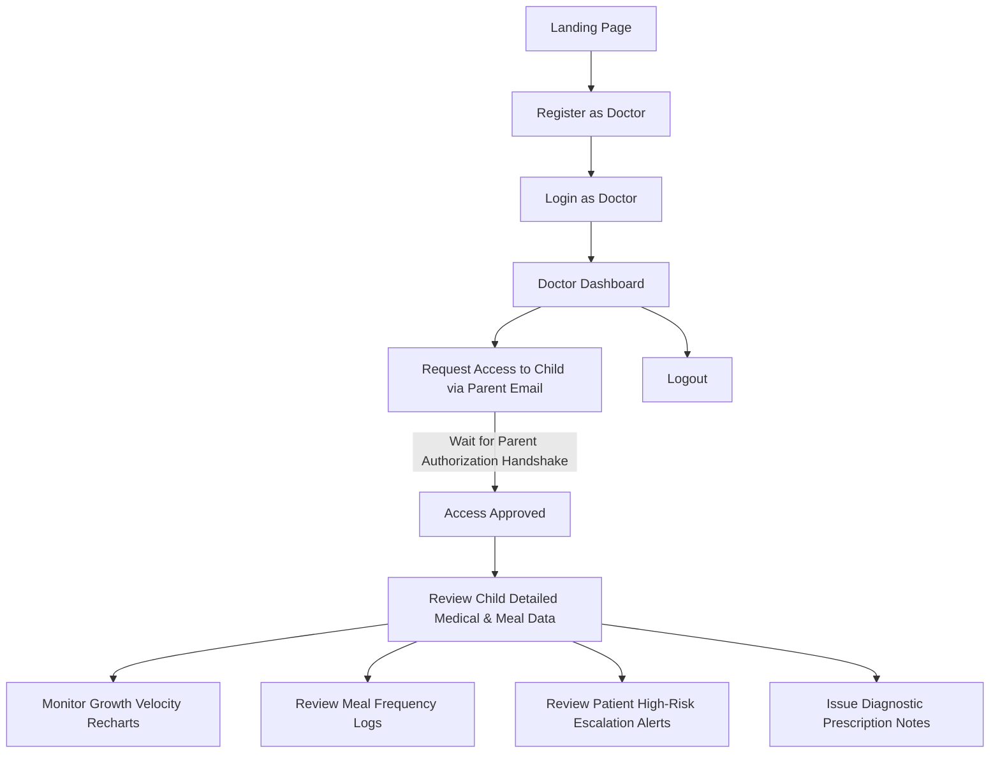
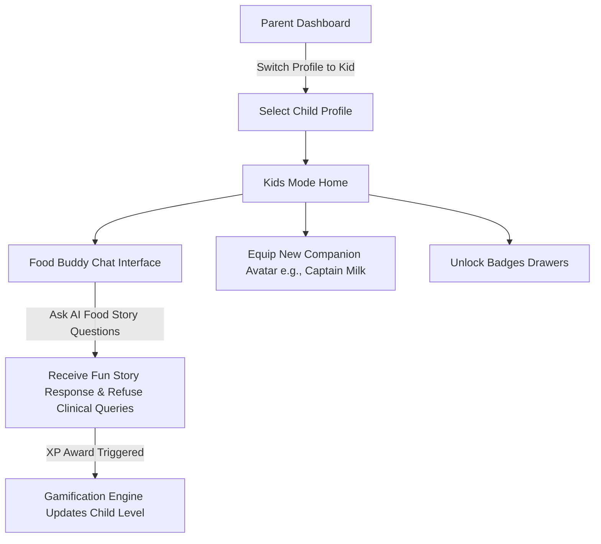

# 🥦 NutriKids: Product Specification Document
## AI-Powered Pediatric Nutrition Intelligence Platform
### Document Reference: `project-spec_18thJune.md`
**Date of Document**: June 18, 2026  
**Audience**: Faculty Evaluators, Internship Reviewers, Project Guides, Non-technical Stakeholders, Onboarding Developers

---


## 1. PRODUCT OVERVIEW

### 🌟 Product Vision
NutriKids is a clinical-grade pediatric nutrition intelligence platform designed to bridge the structural feedback loops between parents, children, and pediatricians. By transforming static nutritional guidelines into a dynamic, safe, RAG-enriched decision engine, NutriKids empowers families with clinically validated dietary planning, gamified kid engagement, and direct medical oversight. 



### 🎯 Product Objectives
* **Response Latency**: Deliver a high-performance web experience achieving $< 200\text{ms}$ response times for transactional routes and $< 1.5\text{s}$ for RAG generation.
* **Clinical Integrity**: Enforce absolute nutritional safety by blocking allergen-linked or illness-restricted foods using deterministic preprocessing filters.
* **Habit Formation**: Drive kid engagement via a gamified companion avatar ("Food Buddy") that awards XP, levels, and badges based on meal completion.
* **Collaborative Care**: Securely connect parents and pediatricians using a granular two-tier authorization handshake.
* **Privacy Controls**: Establish high-grade trust with a parent-toggleable local offline inference model (Privacy Mode).

### 👥 Stakeholders
1. **Faculty Evaluators & Project Guides**: Require academic-grade architectural documentation, clean design pattern validation, and testable codebases.
2. **Internship Reviewers**: Seek enterprise-quality code patterns, standard API specifications, database design integrity, and solid security paradigms.
3. **Parents & Children**: Require clean user journeys, vibrant aesthetics, interactive feedback loop, and immediate health/safety assurance.
4. **Pediatricians**: Need accurate, longitudinal patient records, rapid growth data analysis, automated risk triage, and clean prescription tools.
5. **Developers**: Need a modular, documented codebase with clean interfaces, containerized staging setups, and straightforward local environment scripts.

### 👥 User Roles
* **Parent**: Administrative supervisor of child profiles. Can manage profiles, log dietary data, manage doctor link requests, review gap metrics, and toggle security settings.
* **Doctor**: Healthcare provider. Can request read-only access to child records, configure diagnostic notes, generate clinical prescriptions, and review risk escalations.
* **Child (Kids Mode)**: End-user companion mode. Can interact with the "Food Buddy" mascot, earn XP points, review quests, and unlock badge rewards.

### 🌐 System Boundaries
* **Next.js & React Web Clients**: Handles UI layouts, interactive visual dashboards, local state contexts, and responsive layouts across desktops, tablets, and phones.
* **Express.js API Node Backend**: Manages session state, handles RBAC authentication, governs user ownership, schedules notifications, and coordinates CRUD flows.
* **FastAPI Python AI Microservice**: Hosts the CPU-efficient retrieval engine (BM25 + FAISS), runs local semantic embeddings, enforces safety rules, and routes LLM tokens.
* **MongoDB NoSQL Database**: Serves as the persistence layer for flexible schemas (e.g. nested meal food structures, growth history, escalation flags).

---

## 2. USER ROLES

| Parameter | Parent Role | Doctor Role | Child Role (Kids Mode) |
| :--- | :--- | :--- | :--- |
| **Purpose** | Oversee child’s clinical logs, review gap analytics, ask AI, manage doctor links. | Monitor growth records, write prescriptions, review escalations, write diagnostic notes. | Log child-friendly meal choices, converse with Food Buddy mascot, level up XP. |
| **Permissions** | Write, Edit, Delete own profile and nested child profile records. | Read approved patient profile records. Write prescriptions and notes. | Read own stats. Write chat messages to Food Buddy. No write access to clinical data. |
| **Accessible Pages** | Landing, Parent Dashboard, Child Profile, Meal Log, Analysis, AI Chat, Doctor Access, Settings. | Landing, Doctor Dashboard, Patient Details, Clinical Notes, Escalation Inbox, Settings. | Food Buddy Chat Interface, XP dashboard, Rewards and Badges screen. |
| **Restricted Pages** | Doctor Dashboard, Patient Clinical Notes, Doctor Access Request interface. | Parent Dashboard, Child profile editor, Doctor connection approvals panel. | Parent Dashboard, Doctor Dashboard, doctor invite page, Settings configurations. |
| **Actions Allowed** | Create child profiles; Log daily breakfast, lunch, snack, water; Invite doctors; Accept doctor access requests; Toggle privacy mode. | Search doctor directory; Request profile access; Review growth curves; Record BMI logs; Issue prescriptions; Resolve escalation flags. | Chat with superhero mascot; Earn XP; Equip new companion avatar (e.g., Captain Milk); View badge drawer. |

---

## 3. AUTHENTICATION FLOW

NutriKids implements a stateless authentication workflow leveraging high-entropy JSON Web Tokens (JWT) stored in HTTP-only cookies to verify identity and route requests to appropriate role-based controllers.

### 🛠️ Authentication Screens & Endpoints

#### A. Landing Page
* **Purpose**: Gateway to login or registration portals. Showcases core app benefits, mission, and features.
* **Backend APIs Connected**: None (Static UI).

#### B. Registration Page (`POST /api/auth/register`)
* **Purpose**: Create a new platform identity for a Parent or Doctor.
* **Fields**: Name (`name`), Email (`email`), Password (`password`), Role (`role`), Title (`title`), Phone (`phone`).
* **Validations**: Zod validated schema checks: Email structure, password minimum length (8 chars), role match enum (`parent` | `doctor`).
* **Database Updates**: Writes new record to `User` collection. Password is encrypted using `bcrypt` (10 rounds) in a Mongoose pre-save hook.
* **Success Flow**: Returns HTTP 201 with JWT token and user details. Client redirect to appropriate dashboard.
* **Failure Flow**: Returns HTTP 400 with validation failure errors, or HTTP 409 if email is already registered.

#### C. Login Page (`POST /api/auth/login`)
* **Purpose**: Authenticate credentials and establish an active session.
* **Fields**: Email (`email`), Password (`password`).
* **Validations**: Sanitized string fields.
* **Database Updates**: None on login (reads database records to verify credentials).
* **Success Flow**: Checks password validity using `bcrypt.compare`. Generates HMAC-SHA256 JWT, signs payload containing user ID and role, returns HTTP 200, sets cookie.
* **Failure Flow**: Returns HTTP 401 Unauthorized for invalid email or password mismatch.



---

## 4. COMPLETE USER WORKFLOWS

### 🔄 Parent Journey


### 🩺 Doctor Journey


### 🦁 Child Journey (Kids Mode)


---

## 5. FEATURE SPECIFICATIONS

### Feature 1: Authentication & Role-Based Access Control (RBAC)
* **Purpose**: Restrict access to endpoints based on user credentials and roles.
* **Why Built**: Protect pediatric health records and ensure clinical data isolation.
* **Users Involved**: Parents, Doctors.
* **Inputs**: Credentials (Email, Hashed Password).
* **Outputs**: JWT Token, Route access validation.
* **Database Entities**: `User` collection.
* **API Endpoints**: `/api/auth/register`, `/api/auth/login`, `/api/auth/me`.
* **Workflow**: Client attaches JWT header `Authorization: Bearer <token>`. Middleware `auth.middleware.js` decodes and verifies token; `role.middleware.js` authorizes path access.
* **Success Metrics**: 100% endpoint isolation, unauthorized requests return HTTP 401/403.

### Feature 2: Child Profile Management
* **Purpose**: Manage separate demographic records for children.
* **Why Built**: Allow multi-child management under a single parent account.
* **Users Involved**: Parents.
* **Inputs**: Name, age, dob, gender, height, weight, dietary preferences, health conditions, companion avatar.
* **Outputs**: Structured profile dashboard, gamification stats.
* **Database Entities**: `Profile` collection.
* **API Endpoints**: `/api/profiles` (POST, GET), `/api/profiles/:id` (GET, PUT, DELETE).
* **Workflow**: Parent uploads animal avatar and fills forms; details are validated using Mongoose schema constraints and saved.
* **Success Metrics**: Profile CRUD latency $< 150\text{ms}$.

### Feature 3: Meal Logging
* **Purpose**: Daily record of food and water intake.
* **Why Built**: Gather dietary data for nutrient calculations.
* **Users Involved**: Parents, Children.
* **Inputs**: Meal slot (Breakfast to Dinner), food search query, portion quantity, meal photos.
* **Outputs**: Macro totals, active logged slots.
* **Database Entities**: `MealLog` collection, `Profile` (update streak dates).
* **API Endpoints**: `/api/meals` (POST, DELETE), `/api/meals/history/:id` (GET), `/api/meals/by-date/:id/:date` (GET).
* **Workflow**: Parent searches local food library, selects portions, saves meal, adds photos via multer uploads.
* **Success Metrics**: Sub-100ms log updates.

### Feature 4: Nutrition Analysis
* **Purpose**: Highlight macro and micro dietary gaps.
* **Why Built**: Warn parents about nutritional stunting risks.
* **Users Involved**: Parents.
* **Inputs**: Array of daily meal items.
* **Outputs**: RDA gap warnings, dietary suggestions.
* **Database Entities**: Reads `MealLog` and returns target comparisons.
* **API Endpoints**: `/api/nutrition-analysis` (POST to FastAPI `/analyze`).
* **Workflow**: Sums calories/protein of logged meals, compares against standard targets by age, returns deficiencies list.
* **Success Metrics**: 100% accuracy in calorie aggregation.

### Feature 5: AI Nutrition Assistant (NutriGuide Chat)
* **Purpose**: Conversational pediatric advisor.
* **Why Built**: Provide clinically-validated guidance directly to parents.
* **Users Involved**: Parents.
* **Inputs**: Question, conversational history, child medical parameters.
* **Outputs**: Conversational advice with citation metadata.
* **Database Entities**: None (Stateless).
* **API Endpoints**: FastAPI `/ask` or `/chat`.
* **Workflow**: Check query for prompt injection and severe symptoms; retrieve guidelines via Hybrid RAG; pass to LLM; format detailed toggle.
* **Success Metrics**: average response latency $< 1.5\text{s}$.

### Feature 6: Hybrid RAG Engine
* **Purpose**: Clinical document retrieval engine.
* **Why Built**: Ground AI answers in NIN/ICMR guidelines rather than hypothetical LLM details.
* **Users Involved**: System automated.
* **Inputs**: Raw query string.
* **Outputs**: Ranked document text snippets.
* **Database Entities**: None (In-memory FAISS indices).
* **API Endpoints**: Python core utility.
* **Workflow**: Runs BM25 for lexical match, FAISS for semantic dense match, merges lists via RRF, reranks using Cross-Encoder.
* **Success Metrics**: Mean Reciprocal Rank (MRR) $> 0.85$ on benchmark tests.

### Feature 7: Food Buddy Mascot & Kids Mode
* **Purpose**: Child-friendly gamified dashboard.
* **Why Built**: Engage kids in logging healthy meals.
* **Users Involved**: Children.
* **Inputs**: Kids chat questions.
* **Outputs**: Mascot stories, XP upgrades, badges.
* **Database Entities**: `Profile` (currentXP, level, equippedCompanion).
* **API Endpoints**: `/api/game/chat/:id` (POST), `/api/game/equip/:id` (POST).
* **Workflow**: Child asks questions, system routes with kids-mode instructions, checks query safety, unlocks badges, gives XP.
* **Success Metrics**: Increase consecutive logging streak counts by children.

### Feature 8: Doctor Portal
* **Purpose**: Specialist oversight panel.
* **Why Built**: Bridge the communication gap between family logging and clinical settings.
* **Users Involved**: Doctors.
* **Inputs**: Medical observation notes, prescription advice.
* **Outputs**: Growth velocity charts, patient history overview.
* **Database Entities**: `DoctorAccess`, `User` (DoctorProfile updates).
* **API Endpoints**: `/api/doctor/patients`, `/api/doctor/patients/:id` (GET).
* **Workflow**: Authorized doctor selects patient from panel to view synced meal diary, notes and BMI velocity curves.
* **Success Metrics**: Zero-data leak checks across non-authorized patient profiles.

### Feature 9: Doctor Access Handshake
* **Purpose**: Two-way clinical permission handshake.
* **Why Built**: Maintain compliance and parent control over child clinical logs.
* **Users Involved**: Parents, Doctors.
* **Inputs**: Access request emails, approval/revocation commands.
* **Outputs**: Active connection records.
* **Database Entities**: `DoctorAccess` collection.
* **API Endpoints**: `/api/doctor/request-access`, `/api/access/requests` (GET), `/api/access/approve/:requestId` (PUT).
* **Workflow**: Doctor requests link; parent views request on dashboard, approves (selects Full or Restricted), token access updates.
* **Success Metrics**: 100% compliance audit trace.

### Feature 10: Growth Tracking
* **Purpose**: Record and monitor longitudinal development.
* **Why Built**: Auto-calculate developmental markers and track underweight/obese risks.
* **Users Involved**: Parents, Doctors.
* **Inputs**: Height (cm), Weight (kg).
* **Outputs**: BMI calculation, WHO percentile categorization.
* **Database Entities**: `GrowthRecord` collection.
* **API Endpoints**: `/api/growth/update/:childId` (POST), `/api/growth/:childId` (GET).
* **Workflow**: Logs growth record, computes BMI ($Weight / Height^2$), flags category status.
* **Success Metrics**: 100% deterministic growth calculations.

### Feature 11: Escalation System
* **Purpose**: Pediatric warning triage dashboard.
* **Why Built**: Alerts doctors to high-risk clinical symptoms or severe stunting.
* **Users Involved**: Doctors, System AI.
* **Inputs**: Patient query texts.
* **Outputs**: Escalated status flag, symptoms checklist.
* **Database Entities**: `Escalation` collection.
* **API Endpoints**: `/api/escalations` (GET), `/api/escalations/:id/resolve` (POST).
* **Workflow**: Python safety layer checks query for critical symptoms (e.g. fever, rapid weight loss), logs alert to DB, pushes alert to Doctor dashboard.
* **Success Metrics**: Severity categorization latency $< 15\text{ms}$.

### Feature 12: Privacy Mode
* **Purpose**: Local-first LLM inference toggle.
* **Why Built**: Enable offline capability and satisfy strict privacy requirements.
* **Users Involved**: Parents.
* **Inputs**: Privacy Mode toggle switch.
* **Outputs**: System model redirection.
* **Database Entities**: None.
* **API Endpoints**: Backend routing logic to FastAPI `/ask`.
* **Workflow**: When toggled, ModelRouter diverts queries to local Ollama (Llama3/Mistral) rather than cloud Gemini API.
* **Success Metrics**: 100% cloud bypass when privacy mode is active.

---

## 6. DATABASE DOCUMENTATION

NutriKids utilizes MongoDB as its primary database system to take advantage of flexible, schema-less document hierarchies that suit daily food logs and variable clinical logs.

### 🗃️ MongoDB Collections Architecture

#### 1. `Users` Collection
* **Purpose**: Manage system-wide authentication credentials and profiles for parents and doctors.
* **Relationships**: One-to-Many with `Profiles` (Parent owns children), One-to-Many with `DoctorAccess`.
* **Important Fields**:
  - `name` (String, Required)
  - `email` (String, Unique, Indexed)
  - `password` (String, Bcrypt hashed)
  - `role` (String, Enum: `parent` | `doctor`)
  - `doctorProfile` (Subdocument: specialization, hospitalName, registrationId)
* **Indexes**: `{ email: 1 }` (Unique)
* **Data Flow**: Populated on registration; checked on login; referenced in doctor handshake.

#### 2. `Profiles` Collection
* **Purpose**: Track children's clinical details and gamification records.
* **Relationships**: Many-to-One with `Users` (parentId ref User).
* **Important Fields**:
  - `parentId` (ObjectId ref User, Required)
  - `name` (String, Required)
  - `age` (Number, Required)
  - `avatar` (String, e.g. 'lion', 'fox')
  - `healthConditions` (Array [String])
  - `level` (Number, Default 1)
  - `currentXP` (Number, Default 0)
* **Indexes**: `{ parentId: 1 }`
* **Data Flow**: Created by Parent; read by parent and authorized doctor; updated by gamification logs.

#### 3. `MealLogs` Collection
* **Purpose**: Store granular food items consumed on daily slots.
* **Relationships**: Many-to-One with `Profiles` (profileId ref Profile).
* **Important Fields**:
  - `profileId` (ObjectId ref Profile, Required)
  - `date` (String, YYYY-MM-DD, Indexed)
  - `breakfast` / `lunch` / `dinner` (Array [FoodItemSchema: name, quantity, calories, protein, carbs, fats, fiber, water])
  - `completedMealsCount` (Number, Max 6)
* **Indexes**: `{ profileId: 1, date: 1 }` (Unique compound index)
* **Data Flow**: Appended on parent food log; read by gap analyzer and doctor portal.

#### 4. `GrowthRecords` Collection
* **Purpose**: Store child growth histories for velocity calculation.
* **Relationships**: Many-to-One with `Profiles` (childId ref Profile).
* **Important Fields**:
  - `childId` (ObjectId ref Profile, Required)
  - `height` (Number, cm)
  - `weight` (Number, kg)
  - `bmi` (Number, Auto-calculated)
  - `riskStatus` (String, Enum: underweight | normal | overweight | obese)
  - `recordedByRole` (String, Enum: parent | doctor)
* **Indexes**: `{ childId: 1, timestamp: -1 }`
* **Data Flow**: Recorded on growth submit form; plotted in Recharts; analyzed by growth velocity engine.

#### 5. `DoctorAccess` Collection
* **Purpose**: Manage patient record sharing permissions.
* **Relationships**: References doctor (User), parent (User), and profile (Profile).
* **Important Fields**:
  - `doctorId` (ObjectId ref User, Required)
  - `parentId` (ObjectId ref User, Required)
  - `profileId` (ObjectId ref Profile)
  - `status` (String, Enum: pending | restricted | active | rejected)
  - `fullAccessRequested` (Boolean)
* **Indexes**: `{ doctorId: 1, parentId: 1, profileId: 1 }` (Unique compound index)
* **Data Flow**: Created by doctor request; accepted/rejected by parent; verified by `doctor.middleware.js` on patients clinical route.

#### 6. `Escalations` Collection
* **Purpose**: High-risk medical symptom logging.
* **Relationships**: Many-to-One with `Profiles` (child_id ref Profile).
* **Important Fields**:
  - `child_id` (ObjectId ref Profile, Required)
  - `risk_level` (String, Enum: Low | Medium | High | Critical)
  - `ai_message` (String, Symptom description)
  - `detected_keywords` (Array [String])
  - `resolved` (Boolean)
* **Indexes**: `{ resolved: 1, risk_level: 1 }`
* **Data Flow**: Written automatically by FastAPI guardrails; read by Doctor dashboard Inbox; updated when resolved by clinician.

---

## 7. API CATALOG

All requests (excluding local FastAPI internal queries) require Bearer JWT verification headers.

### 🔐 Authentication API

* **`POST /api/auth/register`**
  - **Purpose**: Registers a new user.
  - **Auth / Role Restrictions**: None.
  - **Request Body**: `{ name, email, password, role, title, phone }`
  - **Response**: `{ success: true, data: { user, token } }`

* **`POST /api/auth/login`**
  - **Purpose**: Authenticates credentials and returns token.
  - **Auth / Role Restrictions**: None.
  - **Request Body**: `{ email, password }`
  - **Response**: `{ success: true, data: { user, token } }`

* **`GET /api/auth/me`**
  - **Purpose**: Retrieves current authenticated profile.
  - **Auth / Role Restrictions**: Auth token required / Parent or Doctor.
  - **Response**: `{ success: true, data: { user } }`

### 👤 Profile API

* **`POST /api/profiles`**
  - **Purpose**: Creates a child profile.
  - **Auth / Role Restrictions**: JWT / Parent role only.
  - **Request Body**: `{ name, age, dob, gender, height, weight, dietaryPreferences, healthConditions, avatar }`
  - **Response**: `{ success: true, data: profileDoc }`

* **`GET /api/profiles`**
  - **Purpose**: Lists all children registered under parent.
  - **Auth / Role Restrictions**: JWT / Parent role only.
  - **Response**: `{ success: true, data: [profileDoc, ...] }`

* **`GET /api/profiles/:id`**
  - **Purpose**: Gets detailed record for one child profile.
  - **Auth / Role Restrictions**: JWT / Parent owner or Authorized doctor with full access.
  - **Response**: `{ success: true, data: profileDoc }`

### 🥗 Meal Logging API

* **`POST /api/meals`**
  - **Purpose**: Logs eaten foods. Supports photo uploads.
  - **Auth / Role Restrictions**: JWT / Parent owner.
  - **Request Body (Multipart)**: `{ profileId, date, mealSlot, foodName, quantity }` + optional files.
  - **Response**: `{ success: true, data: mealLogDoc }`

* **`GET /api/meals/history/:id`**
  - **Purpose**: Gets historical logs.
  - **Auth / Role Restrictions**: JWT / Parent owner or Authorized doctor.
  - **Response**: `{ success: true, data: [mealLogDoc, ...] }`

### 🩺 Doctor Handshake & Portal API

* **`POST /api/doctor/request-access`**
  - **Purpose**: Doctor requests access to a parent's children records.
  - **Auth / Role Restrictions**: JWT / Doctor role only.
  - **Request Body**: `{ parentEmail }`
  - **Response**: `{ success: true, message: "Request sent successfully" }`

* **`GET /api/access/requests`**
  - **Purpose**: Parent checks pending connection requests.
  - **Auth / Role Restrictions**: JWT / Parent role only.
  - **Response**: `{ success: true, data: [accessRequestDoc, ...] }`

* **`PUT /api/access/approve/:requestId`**
  - **Purpose**: Parent approves access.
  - **Auth / Role Restrictions**: JWT / Parent role only.
  - **Request Body**: `{ profileId, accessLevel }` (accessLevel: 'active' | 'restricted')
  - **Response**: `{ success: true, data: accessRequestDoc }`

* **`GET /api/doctor/patients`**
  - **Purpose**: Lists all children profiles linked to the doctor.
  - **Auth / Role Restrictions**: JWT / Doctor role only.
  - **Response**: `{ success: true, data: [patientDoc, ...] }`

### 📈 Growth Tracking API

* **`POST /api/growth/update/:childId`**
  - **Purpose**: Log new growth statistics.
  - **Auth / Role Restrictions**: JWT / Parent owner or Linked doctor.
  - **Request Body**: `{ height, weight, notes }`
  - **Response**: `{ success: true, data: growthRecordDoc }`

---

## 8. AI/ML ARCHITECTURE

NutriKids utilizes a hybrid, multi-stage RAG and fallback chain optimized for medical safety, operational uptime, and low execution latency.

```mermaid
graph TD
    Query[User Query] --> SecurityShield{Prompt Injection / Security Check}
    SecurityShield -- Malicious --> Block[Return Security Warning response]
    SecurityShield -- Safe --> Escalation{Escalation Check}
    Escalation -- Emergency Symptoms --> Emergency[Pediatrician Referral response]
    Escalation -- Safe --> Retrieval[Hybrid Retrieval Engine]
    Retrieval -->|BM25 Lexical Matching| BM25[Keyword Candidates]
    Retrieval -->|FAISS Vector Dense Matching| FAISS[Semantic Candidates]
    BM25 --> Fusion[Reciprocal Rank Fusion RRF]
    FAISS --> Fusion
    Fusion --> Rerank[Cross-Encoder Reranker]
    Rerank --> TopChks[Top Reranked Context Chunks]
    TopChks --> Planner[Planner: Target Target Math & Allergy Block]
    Planner --> Prompt[Construct Unified prompt context]
    Prompt --> Router{Model Router}
    Router -->|Gemini Active| Gemini[Gemini 2.5 Flash]
    Router -->|Privacy Toggle| Ollama[Local Ollama]
    Gemini --> Final[Apply |||DETAILED||| view separation]
    Ollama --> Final
```

### 🧠 Core Components Rationale

* **Google Gemini 2.5 Flash Integration**: Primary cloud LLM engine. Selected due to its fast generation speed ($<1.2\text{s}$ roundtrip), robust parsing, and structural execution of system prompts.
* **Local Ollama Integration**: Privacy-first and offline fallback model. When Privacy Mode is toggled, it routes queries to local `llama3` or `mistral` models, preventing any PII or medical logs from reaching public cloud APIs.
* **Hybrid RAG Pipeline**:
  - **BM25 Lexical Retriever**: Captures keyword terms (e.g. specific Indian dishes like "khichdi" or clinical parameters like "ragi malt") that dense vectors might miss.
  - **FAISS (Dense Vector DB)**: Performs semantic queries over guidelines index using `all-MiniLM-L6-v2` or `e5-small-v2` lightweight models.
  - **Cross-Encoder Reranker**: Performs confidence reranking over combined BM25 and FAISS results using `ms-marco-MiniLM-L-6-v2` to filter context to the top relevant chunks.
* **Model Router**: Manages active traffic. If Gemini API key is missing or encounters timeouts, the router falls back to Ollama; if Ollama is also unavailable, it loads a local static deterministic specialist template.
* **Prompt Construction Layer**: Packages context into strict rules: (1) System constraints, (2) Active child medical factors, (3) RAG contexts, (4) Direct output format instructions.
* **Safety Guardrails**: Checks inputs for pediatric emergency conditions (e.g., "unconscious", "choking") and triggers immediate referral text without invoking LLM tokens. Contains a deterministic pre-processor that completely excludes allergen ingredients from model contexts.

---

## 9. UI SCREEN DOCUMENTATION

All screens implement a sleek glassmorphic HSL theme with micro-animations via Framer Motion and responsive grid systems.

### 🖥️ App Screen Catalog

#### 1. Landing Page
* **Purpose**: Inform public visitors about NutriKids and direct them to auth gateways.
* **Target User**: Unauthenticated Parents, Doctors, Evaluators.
* **Components Present**: Responsive Hero section, feature grids, clinical safety badges, login/register CTA buttons.
* **Actions Available**: Access auth pages.
* **Connected APIs**: None.

#### 2. Register Screen
* **Purpose**: Select profile role and sign up.
* **Target User**: New Parents or Doctors.
* **Components Present**: Title selection tabs, email fields, Zod error indicators, CTA submit button.
* **Actions Available**: Register parent or doctor account.
* **Connected APIs**: `POST /api/auth/register`.

#### 3. Login Screen
* **Purpose**: Sign in to user dashboard.
* **Target User**: Registered users.
* **Components Present**: Email input, password input, role-based redirect routes, error banner.
* **Actions Available**: Login.
* **Connected APIs**: `POST /api/auth/login`.

#### 4. Parent Dashboard
* **Purpose**: Unified cockpit for child tracking.
* **Target User**: Parents.
* **Components Present**: Quick-select Child selector, summary stats (Hydration, Streak, Sleep, Active level), Water logging stats card, doctor connection warning card.
* **Actions Available**: Log quick water (+250ml); switch children; access menus.
* **Connected APIs**: `GET /api/profiles`, `GET /api/meals/last-meal/:id`.

#### 5. Child Profile Page
* **Purpose**: Setup medical configurations and companion avatar.
* **Target User**: Parents.
* **Components Present**: Demographics form, conditions multiselect tag editor, animal avatar grid, submit button.
* **Actions Available**: Create child profile, edit child details, delete profile.
* **Connected APIs**: `POST /api/profiles`, `PUT /api/profiles/:id`, `DELETE /api/profiles/:id`.

#### 6. Meal Log Page
* **Purpose**: Logging daily items across 6 meal slots.
* **Target User**: Parents.
* **Components Present**: Food search list, portion sliders, photo drag-and-drop box, logged item list with macro totals.
* **Actions Available**: Add food to slot, delete food item, upload meal photos.
* **Connected APIs**: `POST /api/meals`, `DELETE /api/meals/item`, `GET /api/meals/by-date/:id/:date`.

#### 7. Nutrition Analysis Page
* **Purpose**: Visual dashboard of calorie and macro gaps.
* **Target User**: Parents.
* **Components Present**: Daily caloric intake progress wheels, missing nutrients cards, AI recommendations box.
* **Actions Available**: View gap breakdowns.
* **Connected APIs**: FastAPI `/analyze-meal` via Express backend.

#### 8. AI Chat (NutriGuide) Page
* **Purpose**: Conversational RAG pediatric assistance.
* **Target User**: Parents.
* **Components Present**: Chat bubble window, history sidebar, detailed toggle switch, Privacy Mode toggle.
* **Actions Available**: Ask pediatric questions, view citations context, toggle detail views.
* **Connected APIs**: FastAPI `/ask` (audience: parent) or `/ws/chat`.

#### 9. Food Buddy Chat Page (Kids Mode)
* **Purpose**: Children companion portal.
* **Target User**: Children.
* **Components Present**: Cartoon avatar animation, gamified question bubble interface, XP progress indicator, equipped companion badge list.
* **Actions Available**: Chat with Food Buddy, equip companion (e.g. Captain Milk).
* **Connected APIs**: `GET /api/game/stats/:id`, `POST /api/game/chat/:id`, `POST /api/game/equip/:id`.

#### 10. Doctor Dashboard
* **Purpose**: Specialist clinic cockpit.
* **Target User**: Doctors.
* **Components Present**: Connected patients grid list, pending access requests mailbox, clinical alerts panel.
* **Actions Available**: Access patient record deep-dive, request patient access via email, resolve alert flags.
* **Connected APIs**: `GET /api/doctor/patients`, `POST /api/doctor/request-access`, `GET /api/escalations`.

#### 11. Doctor Access Handshake Panel
* **Purpose**: Manage physician connections.
* **Target User**: Parents.
* **Components Present**: Active doctors list, pending approval notifications list, permission level dropdown (Restricted vs Full Access).
* **Actions Available**: Approve access requests, reject requests, revoke access.
* **Connected APIs**: `GET /api/access/requests`, `PUT /api/access/approve/:requestId`, `PUT /api/access/revoke/:requestId`.

#### 12. Settings Page
* **Purpose**: Edit accounts and configure default parameters.
* **Target User**: Parents, Doctors.
* **Components Present**: Account forms, change password fields.
* **Actions Available**: Update account profile, edit password.
* **Connected APIs**: `GET /api/auth/me`, `PATCH /api/doctor/update`.

---

## 10. TEAM CONTRIBUTIONS

Below is the structured registry of team members, modules developed, deliverables, and engineering contributions for the NutriKids platform.

### 1. Abhiram: AI Engineer & Feature Development Lead
* **Ownership Areas**: AI Core orchestration, Model Router, Prompt systems, and FastAPI deployment.
* **Modules Developed**: FastAPI Service setup, `ModelRouter` fallback mechanics, prompt builder modules, and safety guardrails.
* **Expected Deliverables**: Clean FastAPI web server, prompt engineering files, comparative benchmark suite, and OpenAI/Gemini/Ollama client connectors.
* **Technical Contributions**:
  - Engineered the fallback routing logic to switch between local Ollama and cloud Gemini.
  - Implemented the emergency guardrail filter and deterministic allergen-exclusion filter in Python.

### 2. Tharun: Backend & Database Engineer
* **Ownership Areas**: Express Node backend framework, Mongoose schemas, and server-side logic validation.
* **Modules Developed**: JWT session logic, middleware suite (`auth.js`, `role.js`, `ownership.js`), and MongoDB collection schemas.
* **Expected Deliverables**: Robust Express backend API, connection handlers, model controllers, and rate limiting middlewares.
* **Technical Contributions**:
  - Developed the compound indexing logic (`profileId_1_date_1`) in MongoDB.
  - Built the two-tier Doctor Access Handshake authorization middleware.

### 3. Dinesh Veera: RAG Engineer
* **Ownership Areas**: Hybrid Retrieval-Augmented Generation pipeline.
* **Modules Developed**: Lexical BM25 indexer, FAISS semantic vector database, and Reciprocal Rank Fusion merging functions.
* **Expected Deliverables**: FAISS database indices (`faiss_textbooks.index`), text chunking scripts, and Cross-Encoder reranker modules.
* **Technical Contributions**:
  - Configured high-fidelity document preprocessing for ICMR and NIN pediatric nutrition textbooks.
  - Developed the `ms-marco-MiniLM-L-6-v2` Cross-Encoder pipeline to reduce context size by 60%.

### 4. Pavan Krishna: Data Engineer & Backend Developer
* **Ownership Areas**: Food Databases, nutrient calculators, and backend routing endpoints.
* **Modules Developed**: 115+ Indian Foods Library database schema, meal logging controller, sleep log evaluation, and activity tracking records.
* **Expected Deliverables**: Populated MongoDB food collection, growth timeline calculators, and meal history controllers.
* **Technical Contributions**:
  - Compiled the 115+ Indian Foods database containing calories, protein, carbs, fiber, and water metrics.
  - Developed the sleep duration assessment algorithm (Poor, Healthy, Oversleep).

### 5. Pavan Vignesh: Frontend & UI/UX Engineer
* **Ownership Areas**: Next.js App Router UI, CSS styles, Recharts graphs, and Framer Motion transitions.
* **Modules Developed**: Parent command center dashboards, Kids Mode chat bubbles, Recharts growth velocity widgets, and Doctor portal layouts.
* **Expected Deliverables**: Next.js client, Tailwind configuration, component directory, and UI views.
* **Technical Contributions**:
  - Crafted the HSL glassmorphic design theme with seamless global transitions.
  - Built the interactive Kids Mode dashboard featuring XP bars and badge animations.

---

## 11. FUTURE ROADMAP

### 🚀 Phase 1: AI Food Image Recognition
* **Description**: Enable parents to snap and upload a photo of a meal plate (e.g., idli, dal) and have Gemini Vision automatically log portion sizes and calories.
* **Dependencies**: Multipart upload gateway, Gemini Vision API integration.

### 📋 Phase 2: Integrated Doctor Prescriptions
* **Description**: Allow doctors to directly link diagnostic advice and nutritional plans to the parent dashboard with checkup countdown timers.
* **Dependencies**: Prescription schema updates, countdown timer notification scripts.

### 📱 Phase 3: Mobile App & Wearable Integration
* **Description**: Export the web dashboard to React Native for direct iOS/Android app deployment and integrate activity tracking from Apple Health/Fitbit.
* **Dependencies**: Expo configuration, device sync APIs.

---

## 12. TRACEABILITY MATRIX

| Feature ID | Functional Requirement (FR) | UI Screen / Entry Point | Connected Express Endpoint | Connected FastAPI Endpoint | MongoDB Collection | Key Developer |
| :--- | :--- | :--- | :--- | :--- | :--- | :--- |
| **F-01** | JWT Authentication & RBAC | Login / Register screens | `/api/auth/register`<br>`/api/auth/login` | None | `Users` | Tharun / Pavan Vignesh |
| **F-02** | Child Profile Management | Profile Configuration Screen | `/api/profiles` | None | `Profiles` | Tharun / Pavan Vignesh |
| **F-03** | Meal & Water Logging | Journal Logging Form | `/api/meals` | None | `MealLogs` | Pavan Krishna / Pavan Vignesh |
| **F-04** | Nutrition Gap Analysis | Analysis Dashboard widget | `/api/nutrition-analysis` | `/analyze` | `MealLogs` | Pavan Krishna / Abhiram |
| **F-05** | AI Assistant Chat | NutriGuide Parent Chat Screen | None | `/ask` | None | Abhiram / Pavan Vignesh |
| **F-06** | Hybrid RAG Retrieval | Automatic AI pipeline | None | Internal utility | None | Dinesh Veera |
| **F-07** | Kids Mode & Food Buddy | Food Buddy chatbot screen | `/api/game/chat/:id` | `/ask` (audience: kid) | `Profiles` | Abhiram / Pavan Vignesh |
| **F-08** | Clinical Doctor Portal | Doctor Dashboard Patients list | `/api/doctor/patients` | None | `DoctorAccess` | Tharun / Pavan Vignesh |
| **F-09** | Doctor Access Handshake | Parents Handshake Settings | `/api/access/requests` | None | `DoctorAccess` | Tharun / Pavan Vignesh |
| **F-10** | Growth Tracking | Growth log card / Recharts | `/api/growth/update` | `/growth/velocity` | `GrowthRecords` | Pavan Krishna / Abhiram |
| **F-11** | Medical Escalations | Doctor Dashboard alerts | `/api/escalations` | Internal Guardrails | `Escalations` | Abhiram / Tharun |
| **F-12** | Local Privacy Mode | Parent chat toggle widget | None | Router fallbacks | None | Abhiram |

---
*End of Specification Document*

