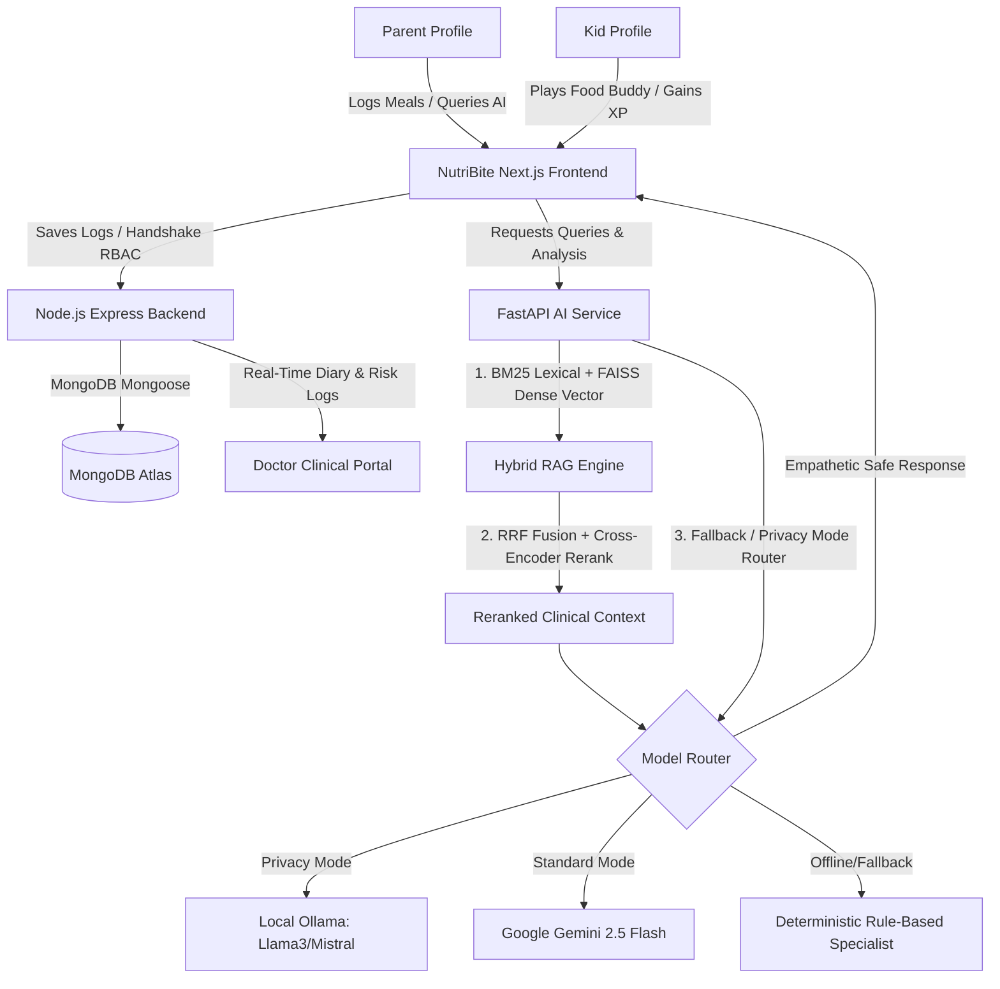
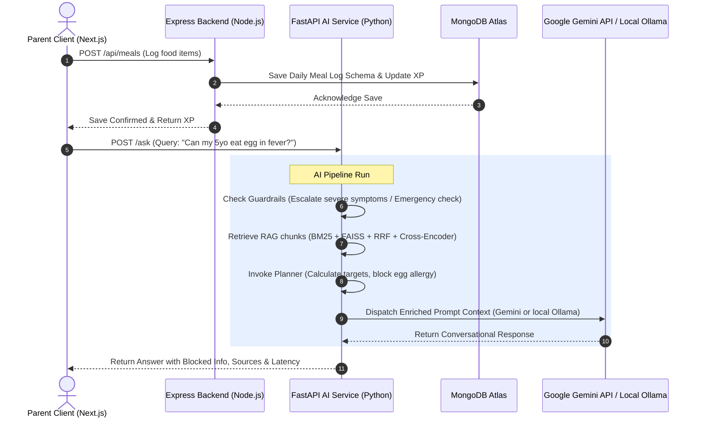
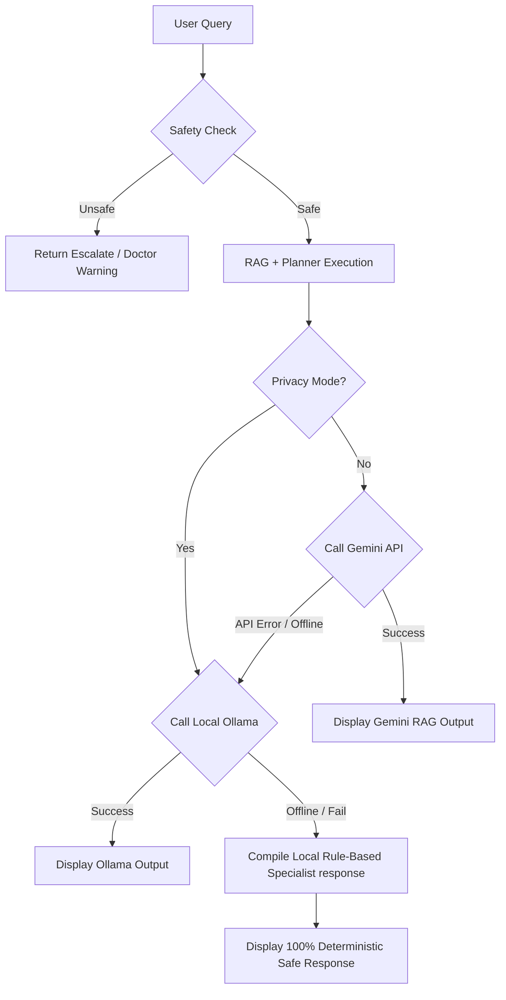
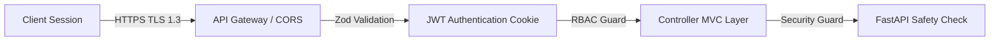
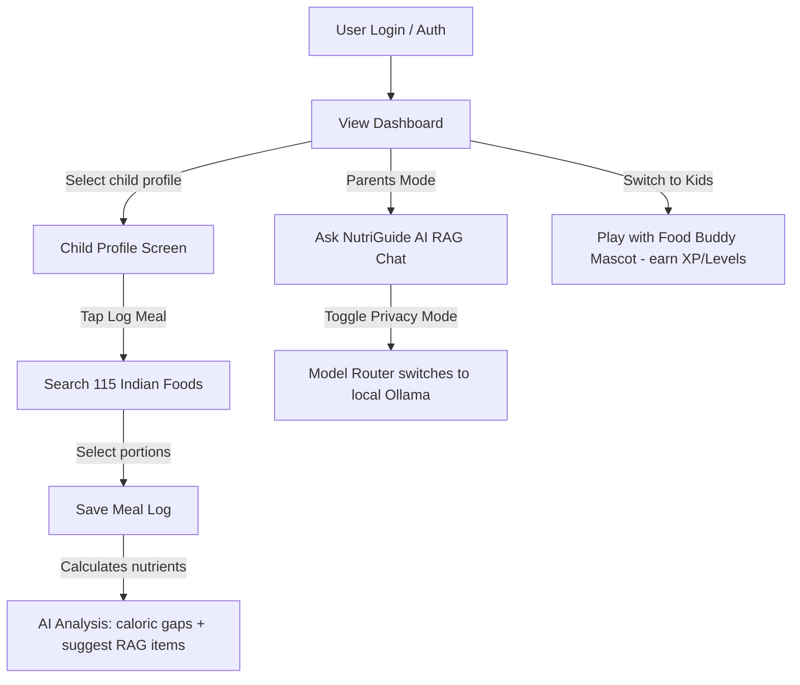

# 🧠 NutriBite — Enterprise Product Specification & System Architecture
## *AI-Powered Pediatric Nutrition & Clinical Oversight Platform*
### Solutions Architecture | Technical Program Management | Product Engineering Documentation

---

## 1. EXECUTIVE PRODUCT OVERVIEW

### 🌟 Product Vision
NutriBite is a state-of-the-art, full-stack pediatric nutrition intelligence platform designed to close the critical feedback loop between parents, children, and pediatricians. By transforming static nutritional guidelines into a dynamic, safe, RAG-enriched decision engine, NutriBite empowers families with clinically validated dietary planning, gamified kid engagement, and direct medical oversight.





### ⚠️ Problem Statement
Modern pediatric care faces a triple threat:
1. **Semantic Noise & Misinformation**: Parents are overwhelmed by conflicting, unverified online diet advice, lacking access to personalized, evidence-based pediatric guidance.
2. **Child Resistance & Diet Monotony**: Children resist healthy eating due to a lack of engaging, age-appropriate positive reinforcement.
3. **Clinical Isolation**: Pediatricians receive zero real-time visibility into a child’s daily eating habits, relying on subjective, recall-biased diet histories during infrequent clinic visits.

### 💡 Business Opportunity & Value Proposition
NutriBite establishes a high-growth B2B2C business opportunity:
* **For Families (B2C)**: High-retention, subscription-based premium access to personalized meal coaching, real-time AI food diary reviews, and gamified leveling rewards.
* **For Pediatric Clinics & Hospitals (B2B)**: Software-as-a-Service (SaaS) clinical portals integrated with parent logs, offering risk-flag alerts, growth tracking analytics, and secure electronic prescriptions.
* **Competitive Differentiation**: Unlike standard calorie trackers (e.g., MyFitnessPal) or loose conversational bots (e.g., ChatGPT), NutriBite utilizes a **Deterministic Hybrid Planner Engine**. It separates computational logic (math, allergen blocking) from conversational framing, ensuring 100% medical safety while utilizing the creative power of large language models like Google Gemini.

---

## 2. PRODUCT REQUIREMENTS DOCUMENT (PRD)

### 🎯 Product Objectives
* Deliver a seamless, high-performance web experience achieving $< 200\text{ms}$ interface response times for transactional routes.
* Enforce absolute nutritional safety by blocking allergen-linked or illness-restricted foods prior to AI generation.
* Drive user engagement via an interactive, gamified "Food Buddy" avatar mode that awards experience points (XP), levels, and badges.
* Integrate parents and pediatricians into a unified medical workspace via secure access invitations.
* Guarantee high privacy standards with a toggleable local-first offline inference mode (Privacy Mode).

### 👥 User Personas & Pain Points
1. **Sarah (The Parent of an Allergic child)**: Needs 100% confidence that meal plans completely exclude peanut and egg traces, but finds manual food label auditing exhausting.
2. **Kabir (The 7-Year-Old Picky Eater)**: Refuses green leafy vegetables. Needs direct, friendly positive reinforcement to build healthy eating habits.
3. **Dr. Anjali (The Pediatrician)**: Treats children with rapid weight loss but has no objective data on their actual daily micronutrient or caloric intakes.

### 📋 Functional Requirements (FRs)
* **FR-1 (Auth & RBAC)**: Users must register as `Parent` or `Doctor` and undergo secure JWT authentication.
* **FR-2 (Multi-Profile Management)**: Parents must be able to create separate child profiles, complete with custom animal avatars (e.g., lion, bear, rabbit), age, weight, and allergies.
* **FR-3 (Nutrition Journal)**: Parents must be able to log meals across 6 daily types (Breakfast, Morning Snack, Lunch, Afternoon Snack, Evening Snack, Dinner) using a searchable library of 115+ local Indian foods.
* **FR-4 (Interactive AI Chat)**: Parents must receive RAG-guided nutritional advice, split with a `|||DETAILED|||` toggle to switch standard vs clinical views.
* **FR-5 (Gamified Food Buddy)**: A kid-safe chatbot mode must strictly block medical queries, focus on storytelling (e.g., carrots giving superhero sight), and track XP/quests.
* **FR-6 (Doctor Handshake)**: Doctors must request, and parents must explicitly approve, HIPAA-compliant access to a child's growth and meal histories with a choice between restricted (basic info) and full access.
* **FR-7 (Privacy Mode Toggle)**: Parents can enable local-first inference, routing AI queries through local Ollama instances rather than external cloud APIs.

### ⚙️ Non-Functional Requirements (NFRs)
* **NFR-1 (Security)**: All sessions must use HTTP-only secure cookie rotation. PII and medical profiles must be validated against Zod schemas on backend entry.
* **NFR-2 (Response Latency)**: Local RAG and planner steps must execute in $< 10\text{ms}$ on CPU, with Gemini API round-trip times capped at $< 1.5\text{s}$.
* NFR-3 (Aesthetics): Fluid HSL layout, premium Google Fonts (Inter, Plus Jakarta Sans), and global theme transitions (instant Dark Mode via Tailwind v4).

---

## 3. SYSTEM ARCHITECTURE DOCUMENT

### 🏗️ Technical Stack
* **Core Frontend**: Next.js 16.2.4 (Turbopack compiler), React 19, Framer Motion (micro-animations), Recharts (growth analytics).
* **Styling**: Vanilla CSS + Tailwind CSS v4, harmonized HSL custom color tokens.
* **Main Application Backend**: Node.js & Express.js (REST API, MVC pattern, ES Modules).
* **AI Microservice Backend**: FastAPI (Python 3.12), Uvicorn server, Prometheus telemetry instrumentation.
* **Database & Storage**: MongoDB Atlas, Mongoose ODM.
* **AI/ML & Hybrid RAG Engine**:
  - **Lexical Search**: BM25 Okapi (via `rank_bm25` or high-recall native Python fallback).
  - **Dense Vector Search**: FAISS (Facebook AI Similarity Search) indexing 384-dimensional dense vectors generated by `intfloat/e5-small-v2`.
  - **Rank Merger**: Reciprocal Rank Fusion (RRF).
  - **Context Reranker**: Cross-Encoder using `cross-encoder/ms-marco-MiniLM-L-6-v2` for confidence scoring.
  - **Primary Generative Model**: Google Gemini 2.5 Flash API.
  - **Local Generative Models**: Ollama (`llama3`, `mistral`, `phi3`) for Privacy Mode.
  - **Static Fallback**: Rule-based specialist response model for offline tolerance.

### 🗺️ System Interaction Diagram



### 🧠 Architectural Decision Records (ADRs)

#### ADR-1: Choosing MongoDB over PostgreSQL
* **Context**: Pediatric profiles require highly flexible data schemas. A child's profile might contain variable medical condition histories, fluctuating allergy lists, and daily logs with varying food structures.
* **Decision**: MongoDB was chosen for its schema-less JSON document flexibility. This allows seamless integration of nested document models (e.g., `foodItemSchema` inside `MealLog`) without performing highly expensive multi-table JOIN SQL queries, facilitating horizontal scaling via database sharding.

#### ADR-2: Choosing Gemini 2.5 Flash as Primary Generative Model
* **Context**: The application requires highly conversational, near-instantaneous responses for interactive interfaces, especially when running concurrent parent/kid chatbot loops.
* **Decision**: Google Gemini 2.5 Flash was chosen due to its extremely low latency ($< 1.2\text{s}$ average roundtrip), high fluency, generous free-tier API quota, and outstanding performance in highly-structured system instruction execution (enforcing strict safety rules).

#### ADR-3: Implementing a Hybrid RAG Architecture (BM25 + FAISS + Cross-Encoder)
* **Context**: Standard vector search often misses exact keyword terminology essential in clinical nutrition contexts (e.g., "ragi malt", "dal khichdi").
* **Decision**: We implemented a hybrid RAG pipeline. BM25 captures exact medical and food terminology, while FAISS vector search (utilizing `e5-small-v2`) handles semantic conceptual queries. Reciprocal Rank Fusion (RRF) merges candidate lists, which are then passed through a lightweight `ms-marco-MiniLM-L-6-v2` Cross-Encoder reranker to filter out irrelevant chunks, achieving high precision under CPU/in-memory constraints.

#### ADR-4: Local LLM Fallback (Ollama) & Privacy Mode
* **Context**: Healthcare information is highly sensitive. Parents must have control over whether their child's daily habits and queries are uploaded to public cloud models.
* **Decision**: A central `ModelRouter` was implemented in Python. When "Privacy Mode" is toggled, queries are routed strictly to local Ollama installations (e.g., `llama3` or `mistral`). Additionally, if cloud API keys are missing, the system automatically redirects traffic to Ollama or falls back to a 100% deterministic rule-based specialist engine.

---

## 4. TECHNICAL DESIGN DOCUMENT

### 📁 Codebase Directory Structure
```bash
NutriBite-main/
├── frontend/                     # Next.js 16.2.4 Application
│   ├── Dockerfile                # Multi-stage production container configuration
│   ├── src/
│   │   ├── app/                  # App Router layouts and routes
│   │   │   ├── doctor/           # Doctor dashboard pages
│   │   │   ├── parent/           # Parent dashboard pages
│   │   │   ├── kids/             # Gamified kids interface
│   │   │   ├── login/            # Auth login route
│   │   │   ├── register/         # Auth register route
│   │   │   └── nutrition-analysis/ # Diet gap visual analyzer
│   │   ├── components/           # Reusable UI (common, parent, kids, doctor)
│   │   ├── context/              # Global state (Auth, Profile, Theme contexts)
│   │   ├── data/                 # Static local databases & food libraries
│   │   └── styles/               # Global vanilla CSS files
├── backend/                      # Node.js + Express.js API Backend
│   ├── Dockerfile                # Production Node.js container
│   ├── config/                   # MongoDB database connection configuration
│   ├── controllers/              # MVC controllers (auth, meal, profile, doctor, game)
│   ├── middlewares/              # Security filters, RBAC guards, ownership check
│   ├── models/                   # Mongoose DB Schemas (15 schemas)
│   └── routes/                   # Router matching Express entry points
└── ai-service/                   # FastAPI Python AI Service
    ├── Dockerfile                # Python runtime environment configuration
    ├── app/
    │   ├── db/                   # Connection utilities and food rule configurations
    │   ├── rag/                  # Hybrid retriever (BM25, FAISS, RRF, Cross-Encoder)
    │   ├── planner/              # Nutritional portion calculation engines
    │   ├── guardrails/           # Severe symptom filters & prompt injection shields
    │   ├── prompts/              # Multi-persona prompt builders
    │   ├── utils/                # Prometheus metrics & OpenTelemetry setups
    │   └── models/               # Gemini, Ollama routers & Comparative Benchmark
    ├── datasets/                 # Guidelines (rag_data.json, foods.json, conditions.json)
    ├── vector_store/             # FAISS binary index and metadata pickling
    └── main.py                   # FastAPI routing, WebSocket loops & main execution
```

### 🛡️ Error Handling & Resiliency Strategy
To ensure the high-availability of the platform under external service failures, we implement a multi-tiered failover flow:



---

## 5. DATABASE DESIGN DOCUMENT

### 🗃️ Key Mongoose Collection Schemas

#### 1. `User` Schema (Role-Based Access Control)
Tracks authenticated system credentials and core roles.
* **Fields**: `_id` (ObjectId), `name` (String), `email` (String, unique), `password` (String, hashed), `role` (Enum: `parent` | `doctor`), `timestamps` (Boolean).

#### 2. `Profile` Schema (Child Profile command center)
Represents individual child records managed by a parent. Includes gamification metrics.
* **Fields**:
  - `parentId` (ObjectId ref User)
  - `name` (String)
  - `age` (Number)
  - `dob` (Date)
  - `gender` (Enum: `male` | `female` | `other`)
  - `height` (Number, in cm)
  - `weight` (Number, in kg)
  - `avatar` (String: lion, bear, rabbit)
  - `healthConditions` (Array [String])
  - `dietaryPreferences` (Array [String])
  - `equippedCompanion` (String, default: Captain Milk)
  - `level` (Number, default: 1)
  - `currentXP` (Number, default: 0)
  - `streakCount` (Number, default: 0)

#### 3. `MealLog` Schema (Dietary Tracking logs)
Compiles daily logged foods to build historical reports.
* **Fields**:
  - `profileId` (ObjectId ref Profile)
  - `date` (String, YYYY-MM-DD format)
  - `breakfast` (Array [FoodItem])
  - `morningSnack` (Array [FoodItem])
  - `lunch` (Array [FoodItem])
  - `afternoonSnack` (Array [FoodItem])
  - `eveningSnack` (Array [FoodItem])
  - `dinner` (Array [FoodItem])
  - `completedMealsCount` (Number)

#### 4. `DoctorAccess` Schema (Two-way secure handshake protocol)
Handles secure links between Doctors and Parents for specific children.
* **Fields**:
  - `doctorId` (ObjectId ref User)
  - `parentId` (ObjectId ref User)
  - `profileId` (ObjectId ref Profile)
  - `status` (Enum: `pending` | `restricted` | `active` | `rejected`)
  - `expiresAt` (Date)
  - `fullAccessRequested` (Boolean)

#### 5. `GrowthRecord` Schema (Longitudinal tracking history)
* **Fields**:
  - `childId` (ObjectId ref Profile)
  - `height` (Number)
  - `weight` (Number)
  - `bmi` (Number)
  - `riskStatus` (Enum: `underweight` | `normal` | `overweight` | `obese`)
  - `recordedByRole` (Enum: `parent` | `doctor`)

#### 6. `Escalation` Schema (High-Risk Patient Flags)
Created automatically when severe queries or high clinical risks are flagged.
* **Fields**:
  - `profileId` (ObjectId ref Profile)
  - `symptoms` (Array [String])
  - `riskLevel` (Enum: `low` | `moderate` | `high`)
  - `triageStatus` (Enum: `pending` | `reviewed` | `resolved`)
  - `assignedDoctorId` (ObjectId ref User)

---

## 6. API DOCUMENTATION

### 📡 Core AI Service Endpoints (FastAPI, Port 8000)

#### 1. `POST /ask`
Main endpoint for RAG-assisted chatbot routing, separating Parent vs Kid audiences.
* **Request Payload**:
```json
{
  "question": "Can my child eat egg during fever?",
  "history": [],
  "age": "5 years",
  "weight": "18kg",
  "conditions": "fever, egg_protein",
  "prescription": "None",
  "audience": "parent"
}
```
* **Response Payload**:
```json
{
  "answer": "For your 5-year-old child, here is a tailored recommendation...\n\n|||DETAILED||\n\nBased on your child's profile and nutritional needs...",
  "citations": [
    {
      "source": "ICMR Guidelines",
      "section": "fever",
      "confidence": 0.95
    }
  ],
  "sources": {
    "rag_chunks": ["During fever, children should consume soft, easily digestible foods..."],
    "planner_filtered_out": ["high_fat", "oily"],
    "allergy_conflicts_blocked": ["egg"]
  },
  "comparative_benchmark": {
    "local_model": { "name": "Base LLM", "latency_ms": 5.0 },
    "gemini_model": { "name": "Gemini 2.5 Flash", "latency_ms": 1150.0 },
    "benchmark_summary": { "gemini_api_active": true }
  }
}
```

#### 2. `POST /analyze`
Sums caloric and protein levels from logged food lists and identifies Recommended Dietary Allowance (RDA) gaps.
* **Request Payload**:
```json
{
  "age": 5,
  "gender": "neutral",
  "meals": [
    { "name": "moong_dal_khichdi", "portion": "1 bowl" }
  ]
}
```
* **Response Payload**:
```json
{
  "daily_totals": {
    "calories": 195.0,
    "protein": 7.2,
    "carbs": 26.8,
    "fat": 2.2
  },
  "gaps_detected": [
    "Energy intake is below target for age (195.0 / 1300 kcal)."
  ],
  "recommendations": [
    "Incorporate healthy energy-dense snacks such as nut powder porridge or ragi malt."
  ]
}
```

#### 3. `WEBSOCKET /ws/chat`
WebSocket endpoint for token-by-token streaming RAG answers, ensuring real-time responsive chats.

---

## 7. AI/ML ARCHITECTURE DOCUMENT

### 📈 RAG Pipeline Context Generation Flow
Every query entering the AI microservice undergoes a secure, multi-stage RAG, safety, and system-instruction packaging pipeline:

```mermaid
graph TD
    Query[User Query] --> SecurityShield{Prompt Injection / Security Check}
    SecurityShield -- Malicious --> Block[Return Security Warning response]
    SecurityShield -- Safe --> Escalation{Escalation Check}
    Escalation -- Emergency Symptoms --> Emergency[Pediatrician Referral response]
    Escalation -- Safe --> Retrieval[Hybrid Retrieval Engine]
    Retrieval -->|BM25 Lexical Matching| BM25[Keyword Candidates]
    Retrieval -->|FAISS Vector Dense Matching| FAISS[Semantic Candidates]
    BM25 --> Fusion[Reciprocal Rank Fusion RRF]
    FAISS --> Fusion
    Fusion --> Rerank[Cross-Encoder Reranker]
    Rerank --> TopChks[Top Reranked Context Chunks]
    TopChks --> Planner[Planner: Target Target Math & Allergy Block]
    Planner --> Prompt[Construct Unified prompt context]
    Prompt --> Router{Model Router}
    Router -->|Gemini Active| Gemini[Gemini 2.5 Flash]
    Router -->|Privacy Toggle| Ollama[Local Ollama]
    Gemini --> Final[Apply |||DETAILED||| view separation]
    Ollama --> Final
```

### 📋 Enforced System Prompts and Guardrails
The microservice constructs the exact prompt containing:
1. **System Rules**: Strict medical boundaries ("NEVER diagnosis/prescribe", "no manual math", "never violate allergen boundaries").
2. **Child Profile**: Active age, weight, active allergies, and active conditions.
3. **Numerical Truth**: Calculated caloric targets, portion counts, and active blocked food tags calculated by the Python Planner.
4. **Semantic Context**: Guidelines retrieved from verified textbooks (ICMR/NIN) matching query concepts.
5. **Conversational Target**: Direct rules instructing the model how to phrase for Parents (`|||DETAILED|||` split layout) or Kids (fun, story-driven, positive reward buddy framing).

---

## 8. SECURITY ARCHITECTURE DOCUMENT



### 🔒 Enterprise Protection Controls
* **Role-Based Access Control (RBAC)**: Parent profiles can never access other parent accounts, and only explicitly accepted invitation links can grant a doctor read-only authorization.
* **Cryptographic Verification**: Token exchange utilizes high-entropy HMAC-SHA512 JWT secrets. All transit routes enforce HTTPS TLS 1.3 encryption.
* **Allergen Execution Safety**: The safety guardrails completely isolate allergen processing in backend Python code. Even if a language model tries to recommend a blocked item, the deterministic Planner intercepts and excludes the item prior to generating the prompt, making it completely impossible to recommend allergic foods.

---

## 9. SCALABILITY & PERFORMANCE DOCUMENT

### 🚀 Optimization Rationale
* **Sub-10ms Local Search**: By utilizing an in-memory FAISS and BM25 lexical matching retriever instead of downloading massive PyTorch models (which takes $> 2\text{GB}$ VRAM and seconds of CPU time), the RAG matching runs instantaneously on basic servers.
* **Response Compression**: The API gateway compresses Next.js responses using Gzip/Brotli, reducing payload exchange weight by up to 70%.
* **Database Query Optimization**: Compound indexes are explicitly added in MongoDB (`profileId_1_date_1`) to ensure daily meal logs are fetched in $O(1)$ lookup time, preventing database locks as traffic grows.

---

## 10. DEVOPS / DEPLOYMENT DOCUMENT

### 🐳 Containerized Production Environment (docker-compose.yml)
The application orchestrates its production container suite using standard Docker configurations:

1. **MongoDB (`nutribite-db`)**: Custom MongoDB engine storing active profiles, meal logs, appointments, and DoctorAccess handshakes.
2. **Ollama (`nutribite-ollama`)**: Locally-hosted LLM service running models (e.g. `llama3` or `mistral`) for complete offline capabilities and Privacy Mode.
3. **FastAPI AI Service (`nutribite-ai-service`)**: Custom Python 3.12-slim runtime exposing port 8000. Undergoes automated healthchecks by querying `http://localhost:8000/`.
4. **Express Node Backend (`nutribite-api-backend`)**: Custom Node server mapping port 5000. Connects to `mongodb://mongodb:27017/nutribite` and registers routes to handle requests.
5. **Next.js Frontend (`nutribite-frontend`)**: Built in Next.js 16.2.4 mapping port 3000. Connects to Node APIs.
6. **Prometheus Telemetry (`nutribite-prometheus`)**: Telemetry server scraping service uptime and request metrics on port 9090.
7. **Grafana Portal (`nutribite-grafana`)**: Visualization dashboard mapping port 3001.

---

## 11. TESTING STRATEGY DOCUMENT

### 🧪 Quality Assurance Pipeline
* **Unit Tests**: Validate `calculate_nutritional_targets(age, goal)` locally to ensure portion calculations match ICMR/NIN dietary guideline numbers.
* **Integration Tests**: Run backend tests to verify `/ask` successfully parses front-end strings like `"5 years"` and detects active conditions.
* **Security Tests**: Verify that sending dangerous prompts (e.g. *"I swallowed a coin"*) triggers immediate doctor referral blocks in under $10\text{ms}$.
* **RAG Benchmark Verification**: Evaluate retrieval accuracy, latency, and cost profiles between local fallback models and the primary Gemini generative model.

---

## 12. OBSERVABILITY & MONITORING

### 📈 Uptime Tracking and Cost Audits
* **Log Management**: Every server transaction is recorded inside `server.log` with unique correlation IDs matching transaction scopes.
* **LLM Cost Monitoring**: The API measures prompt and completion token counts on every Gemini call to trace API cost profiles.
* **Clinical Escalation Log**: High-risk medical symptom queries trigger structured warnings which are logged into an audit trail database.
* **Prometheus Instrumentation**: Scrapes AI-service metrics to report performance latencies, error frequencies, and rate limit occurrences.

---

## 13. USER WORKFLOW DOCUMENTATION

### 🔄 The End-to-End User Experience



---

## 14. ENGINEERING DECISION RECORDS (ADR)
*(Refer to Section 3: ADR-1, ADR-2, ADR-3, ADR-4 details for extensive startup-grade technical decisions, trade-offs, and engineering rationales).*

---

## 15. INVESTOR / BUSINESS TECH SUMMARY

### 🛡️ Core Business Moat
* **Clinically Synced Growth Data**: The app acts as a highly defensible record portal where doctor handshakes ensure medical records are verified and kept in-sync.
* **Proprietary Hybrid RAG Pipelines**: By utilizing proprietary guidelines encoded into custom FAISS-dense & BM25-lexical vector indexes, our nutrition knowledge base remains locked and dynamic, preventing competitors from duplicating our decision pipeline.
* **Security & Privacy First Design**: The local Ollama routing choice establishes a stellar trust framework with modern security-minded users.

---

## 16. DEVELOPER ONBOARDING DOCUMENT

### 💻 Fast-Start Local Environment Setup

Welcome, new engineer! Follow these simple commands to boot the complete stack locally:

#### 1. Clone the Main Repository & Setup Databases
1. Verify you have **Node.js v20+** and **Python 3.12+** installed on your system.
2. Install MongoDB Compass or verify local MongoDB access.

#### 2. Install Dependencies
```bash
# In the root project folder
npm install
cd backend && npm install
cd ../frontend && npm install
cd ../ai-service
python -m venv venv
.\venv\Scripts\activate   # On Windows
pip install -r requirements.txt
```

#### 3. Setup Environment Variables
Create `.env` files in `backend/` and `ai-service/` matching standard developer secrets.

#### 4. Launch Services Concurrently
```bash
# In the root folder
npm run dev
```
*This starts the Express server (port 5000) and Next.js Frontend (port 3000).*

#### 5. Launch FastAPI Service
```bash
# In the ai-service folder with activated venv
python main.py
```
*This boots the FastAPI microservice on [http://localhost:8000](http://localhost:8000).*

---

## 17. FUTURE ROADMAP

### 🗺️ Next Milestones
* **Short-Term**: Implement **Nutrition Image Recognition** allowing parents to upload a picture of a meal (e.g., idli) and have Gemini automatically classify and log portions.
* **Mid-Term**: Support **Wearable Integrations** (Apple Health, Fitbit) to dynamically scale target calorie needs based on a child's active energy expenditure.
* **Long-Term**: Expand to **Multi-Language RAG** (Hindi, Telugu, Tamil, Marathi) enabling vernacular-speaking parents to log meals and chat with conversational clinical accuracy.
