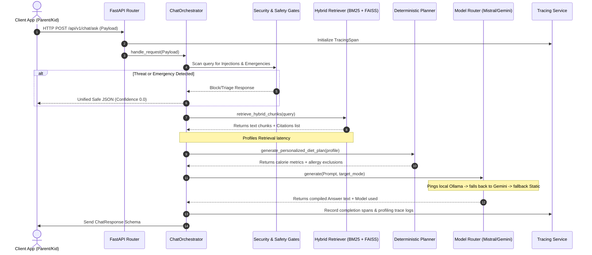

# 🔄 request_flow: End-to-End Execution Flow

This document details how a user query moves through the structured foundation architecture in `ai-service-v2`.

---

## 1. Request Lifecycle Diagram

---

## 2. Component Explanations

1. **Security Interception**: Threat gates analyze user prompts immediately. If prompt injection strings or jailbreak commands are detected, execution halts. It does not waste RAG resources or LLM tokens, returning a clean interception verdict instantly.
2. **Safety Gates**: Regular checks search for pediatric emergency keywords. For kids mode, bedtime lockdowns and medical vocabulary restrictions are enforced.
3. **Retrieval**: Retrieval parses the query, matches tokens using standard BM25, searches FAISS inner-product spaces using sentence embeddings, merges inputs via Reciprocal Rank Fusion, and reranks candidate documents using a Cross-Encoder.
4. **Deterministic Calculation**: Algorithmic planner constructs numerical diet plans. It scores meals, adjusts portions, validates caloric bounds, and isolates allergenic foods.
5. **Centralized Routing**: System dispatches structured prompts. Model router prioritizes local Mistral, fallback APIs, and rule-based specialists.
