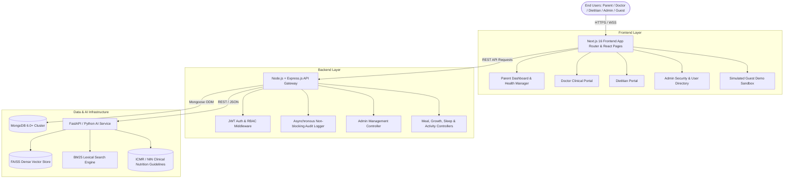

# 🥗 NutriKids (NutriBite) — Comprehensive Project & Technical Documentation

> **Version**: 2.0.0-PROD  
> **Repository**: [KidsNutriBite / NutriBite](https://github.com/KidsNutriBite/NutriBite)  
> **Target Audience**: Families, Pediatricians, Pediatric Dietitians, Clinical Administrators  
> **Core Mission**: AI-powered pediatric nutrition, developmental growth monitoring, clinical oversight, and habit gamification for children aged 1–12.

---

## 📑 Table of Contents
1. [Executive Summary](#1-executive-summary)
2. [System Architecture & Technology Stack](#2-system-architecture--technology-stack)
3. [User Roles & RBAC Matrix](#3-user-roles--rbac-matrix)
4. [Detailed Module & Feature Specifications](#4-detailed-module--feature-specifications)
   - [4.1 Parent Portal & Health Management](#41-parent-portal--health-management)
   - [4.2 Doctor & Clinical Oversight Portal](#42-doctor--clinical-oversight-portal)
   - [4.3 Pediatric Dietitian Portal](#43-pediatric-dietitian-portal)
   - [4.4 Central Admin Management & Security Portal](#44-central-admin-management--security-portal)
   - [4.5 Read-Only Guest / Demo Mode](#45-read-only-guest--demo-mode)
   - [4.6 AI, RAG & Digital Twin Engine](#46-ai-rag--digital-twin-engine)
   - [4.7 Kids Gamification & Engagement Engine](#47-kids-gamification--engagement-engine)
5. [Database Schemas & Data Modeling](#5-database-schemas--data-modeling)
6. [RESTful API Routes Catalog](#6-restful-api-routes-catalog)
7. [Security, Authentication & Audit Telemetry](#7-security-authentication--audit-telemetry)
8. [Installation, Seeding & Execution Guide](#8-installation-seeding--execution-guide)

---

## 1. Executive Summary

**NutriKids** is an enterprise-grade pediatric health platform engineered to bridge the clinical gap between daily parental meal logging, pediatric growth trajectory analysis (WHO & CDC benchmarks), and real-time clinical intervention. 

### Key Pillars:
- **Parental Ease**: Fast 6-slot daily meal logging, 1-click water tracking, 115+ Indian food database, sleep and activity monitoring.
- **Clinical Accuracy**: WHO growth percentile mapping, electronic pediatric prescriptions, and structured Doctor-Parent handshakes.
- **Safety First**: Deterministic allergen filtering on AI recommendations, preventing pediatric allergy exposure.
- **Administrative Control**: Role-based access control (RBAC), multi-factor authentication (2FA), non-blocking audit logging, and account suspension controls.
- **Exploratory Demo**: Full read-only Guest Mode sandbox with zero database footprint.

---

## 2. System Architecture & Technology Stack



### Complete Technology Stack:

| Tier | Technologies / Frameworks | Purpose |
| :--- | :--- | :--- |
| **Frontend Framework** | **Next.js 16.2.4 (Turbopack)**, **React 19.2.4** | High-performance server-rendered and client-rendered hybrid web platform |
| **Styling & Design System** | **Tailwind CSS 4.0**, Vanilla CSS, CSS Variables | Curated responsive theme with Light / Dark mode toggle and micro-interactions |
| **UI Componentry & Animation** | **Framer Motion 12.38**, GSAP 3.15, Lottie React | Smooth physics-based transitions, dialog animations, and visual delight |
| **Data Visualization** | **Recharts 3.8.1** | WHO percentile growth curves, macronutrient distribution, and health trends |
| **Backend Runtime & Framework**| **Node.js (ES Modules)**, **Express.js 4.x** | High-throughput REST API server with structured modular routing |
| **Database & ODM** | **MongoDB 6+**, **Mongoose 8+** | Document-oriented storage with compound indices and schema validation |
| **Security & Cryptography** | **Bcrypt**, **JSON Web Tokens (JWT)**, 2FA OTP | Secure authentication, password hashing, and session management |
| **AI, NLP & RAG** | **Python 3.10+**, **FastAPI**, **LangChain**, **FAISS** | Retrieval-Augmented Generation over ICMR/NIN pediatric nutritional standards |
| **Realtime Communication** | **Socket.io 4.8.3** | Live parent-doctor messaging and event notifications |

---

## 3. User Roles & RBAC Matrix

The system enforces strict Role-Based Access Control across five distinct access tiers:

| Feature / Access Area | Guest (`guest`) | Parent (`parent`) | Doctor (`doctor`) | Dietitian (`dietitian`) | Admin (`admin`) |
| :--- | :---: | :---: | :---: | :---: | :---: |
| **Landing & Public Pages** | ✅ View | ✅ View | ✅ View | ✅ View | ✅ View |
| **Simulated Guest Sandbox (`/guest`)** | ✅ View (Locked Actions) | ✅ View | ✅ View | ✅ View | ✅ View |
| **Child Profile Creation & Editing** | 🔒 Modal Prompt | ✅ Full Control | ❌ Denied | ❌ Denied | 👁️ Read-Only Inspect |
| **Meal, Sleep, Water, Activity Logging**| 🔒 Modal Prompt | ✅ Full Control | ❌ Denied | ❌ Denied | 👁️ Read-Only Inspect |
| **WHO Growth Tracking & BMI Analysis** | 🔒 Modal Prompt | ✅ Full Access | ✅ Verified Entry | ✅ View | 👁️ Read-Only Inspect |
| **AI NutriGuide & RAG Chat** | 🔒 Modal Prompt | ✅ Full Access | ❌ Denied | ❌ Denied | ❌ Denied |
| **Doctor Consultations & Appointments** | 🔒 Modal Prompt | ✅ Book / View | ✅ Manage Slots | ❌ Denied | 👁️ Read-Only Inspect |
| **Clinical Prescriptions & Timers** | ❌ Denied | 👁️ Read Only | ✅ Full Control | ❌ Denied | 👁️ Read-Only Inspect |
| **Dietitian Meal Plans & Cases** | ❌ Denied | 👁️ Read Only | ✅ Collaborate | ✅ Full Control | 👁️ Read-Only Inspect |
| **Admin Dashboard & Stats (`/admin`)** | ❌ 403 Forbidden | ❌ 403 Forbidden | ❌ 403 Forbidden | ❌ 403 Forbidden | ✅ Full Control |
| **User Directory & Status Toggling** | ❌ 403 Forbidden | ❌ 403 Forbidden | ❌ 403 Forbidden | ❌ 403 Forbidden | ✅ Full Control |
| **Security Telemetry & Audit Logs** | ❌ 403 Forbidden | ❌ 403 Forbidden | ❌ 403 Forbidden | ❌ 403 Forbidden | ✅ Full Control |

---

## 4. Detailed Module & Feature Specifications

### 4.1 Parent Portal & Health Management

The Parent Portal is the central interface for daily pediatric health tracking:

1. **Child Profile Management**:
   - Multi-child registration with name, date of birth, biological gender, blood group, height, weight, waist circumference, and primary/secondary health goals.
   - Fun "Food Buddy" avatar assignment (🦁 Lion, 🐻 Bear, 🐰 Rabbit, 🦊 Fox, 🐱 Cat, 🐶 Dog).
   - Medical background records: chronic conditions, premature birth tracking, vaccination records, and allergy profiles.

2. **6-Slot Daily Meal & Food Journal**:
   - Structured slots: **Breakfast**, **Morning Snack**, **Lunch**, **Afternoon Snack**, **Dinner**, and **Evening Snack**.
   - Searchable database of **115+ Indian Foods** with granular nutritional breakdowns (calories, protein, carbohydrates, fats, fiber, vitamins, and water).
   - Meal photo attachment and thumbnail rendering.
   - Real-time macronutrient distribution gauge against age-specific daily targets.

3. **1-Click Hydration Logging**:
   - Visual glass visualizer (target vs. actual intake).
   - Direct `+ 250ml Glass` quick-add button for instant logging.
   - Timestamped hydration log history and daily hydration streaks.

4. **Sleep Consistency Tracker**:
   - Bedtime and wake-up time entry with automatic duration and quality evaluation:
     - `Poor Sleep` (< 8 hours)
     - `Healthy` (8–10 hours)
     - `Oversleep` (> 10 hours)
   - Multi-day historical sleep timeline.

5. **Physical Activity & Energy Expenditure**:
   - Movement tracking across various exercise types (Cycling, Swimming, Outdoor Play, Gymnastics, School PE).
   - Intensity calculation (Moderate vs. Vigorous) and calorie burn estimations.

6. **WHO Growth Curve Velocity Center**:
   - Continuous height and weight trajectory plotted against WHO percentile curves ($3^{\text{rd}}$, $15^{\text{th}}$, $50^{\text{th}}$, $85^{\text{th}}$, $97^{\text{th}}$ percentiles).
   - Real-time BMI and risk classification (`underweight`, `normal`, `overweight`, `obese`).

7. **Grocery Deficiency Insights & Cart Export**:
   - Identifies micronutrient gaps (e.g., Iron, Calcium, Vitamin D, Omega-3).
   - Automatically recommends targeted whole foods to bridge gaps.
   - Exportable grocery shopping checklist (`NutriKids-grocery-cart-[profileId].txt`).

---

### 4.2 Doctor & Clinical Oversight Portal

Designed for pediatricians and clinical endocrinologists:

1. **Secure Handshake Authorization**:
   - Doctors request profile access via parental email invitation.
   - Two-level RBAC:
     - **Restricted View**: Basic demographics and parental consultation notes.
     - **Full Clinical Access**: Growth history, dietary logs, and clinical brief integration.
2. **Clinical Briefs & Electronic Prescriptions**:
   - Structured digital prescription generation linked to child records.
   - Diagnostic notes, medication schedules, and dietary modifications.
3. **Custom Checkup Countdown Timers**:
   - Pediatricians set clinical recall intervals (e.g., 30, 60, 90 days).
   - Generates an active timeline countdown on the parent's dashboard (`X days left for next clinical checkup`).
4. **Growth Velocity & Risk Alerts**:
   - Automatic highlighting of growth stagnation, percentile drops, or rapid BMI drift.

---

### 4.3 Pediatric Dietitian Portal

1. **Case Management Directory**:
   - Filter and manage referred pediatric cases requiring medical nutrition therapy (MNT).
2. **Personalized Meal & Macro Planning**:
   - Create clinical nutrition plans customized for specific health conditions (e.g., Celiac disease, Type 1 Diabetes, lactose intolerance, severe allergies).
3. **Multidisciplinary Doctor Collaboration**:
   - Collaborative group consultation linking pediatrician, dietitian, and parent.

---

### 4.4 Central Admin Management & Security Portal

The Admin Portal acts as the central administrative and security backbone:

1. **Real-Time Telemetry Dashboard (`/admin/dashboard`)**:
   - Real-time aggregation cards: Total Users, Total Child Profiles, Active/Inactive/Suspended counts, 2FA Adoption Rate, and 24h Login Statistics.
   - Interactive role distribution charts and recent audit event streams.
2. **User Management Directory (`/admin/users`, `/admin/parents`, `/admin/doctors`)**:
   - Searchable, filterable user directory with pagination.
   - **Account Status Toggling**: Instantly toggle user status between `Active`, `Inactive`, and `Suspended`. Suspended users are immediately blocked at the authentication layer with `403 Forbidden`.
   - **Non-Sensitive Profile Inspection**: Modal inspecting user account details, phone number, creation date, and linked children without exposing clinical medical notes.
   - **Safe Deletion Protocol**: User removal with double-confirmation and automatic self-deletion prevention for the active admin.
3. **Activity & Security Audit Logging (`/admin/activity`)**:
   - Comprehensive audit logging (`LoginAudit`) recording:
     - Timestamp, User Email, Role, Action (Login, Logout, Status Change, 2FA Change, User Deletion), IP Address, User Agent, and Result (`SUCCESS` / `FAILED`).
   - Action-type filtering and search capabilities.
4. **Security Hardening & Telemetry (`/admin/security`)**:
   - Organization-wide 2FA status monitoring.
   - Session duration configuration and failed login attempt rate monitoring.
   - Admin account 2FA toggle.

---

### 4.5 Read-Only Guest / Demo Mode

An isolated sandbox allowing prospective users and reviewers to explore NutriKids:

1. **Simulated Demo Child (Ananya Sharma)**:
   - **Age**: 7 years | **Gender**: Female | **Blood Group**: B+
   - **Vitals**: Height: `118 cm` | Weight: `21.4 kg` | BMI: `15.4 kg/m²`
   - **Targets**: Sleep: `9.0 hrs` | Hydration: `1500 ml` | Activity: `Moderate`
   - **Allergies**: Peanuts & Tree Nuts (Severe Type I), Artificial Colors (Moderate)
2. **8 Viewable Health Sections**:
   - Health Overview, Child Profile, Growth & WHO Charts, Food Journal, Hydration, Sleep, Activity, and Medical Background.
3. **Strict Action Lockdown**:
   - Over 15 mutating buttons (`Add Child`, `Edit Profile`, `Log Food`, `Add Measurement`, `Log Water`, `Log Sleep`, `Add Activity`, `Add Allergy`, `Book Consultation`, `NutriGuide AI`) display a subtle lock badge 🔒.
   - Clicking any locked action opens the reusable `LoginRequiredModal` offering direct pathways to `[ Login ]`, `[ Create Account ]`, or `[ Continue Exploring ]`.
4. **Zero-Database Safety Guarantee**:
   - Entirely contained in-memory (`demoChildData.js`).
   - Zero mutation APIs called, zero real patient data exposed, and zero database records created.

---

### 4.6 AI, RAG & Digital Twin Engine

1. **Retrieval-Augmented Generation (RAG)**:
   - Hybrid lexical (BM25) and dense vector (FAISS) search over ICMR (Indian Council of Medical Research) and NIN (National Institute of Nutrition) pediatric dietary guidelines.
2. **Deterministic Allergen Shield**:
   - Code-level validation runs prior to LLM generation, explicitly filtering out foods matching the child's recorded allergies.
3. **Clinical / Simple Summary Toggle**:
   - Parents can toggle between simple conversational explanations and `|||DETAILED|||` clinical source references.
4. **Predictive Digital Twin Simulation**:
   - Models the child's physical growth trajectory based on current calorie, macro, and micro intake patterns.

---

### 4.7 Kids Gamification & Engagement Engine

1. **Food Buddy Companion**:
   - Children adopt an animated Food Buddy avatar that gains XP as meals, water, and sleep are logged.
2. **Habit Streaks**:
   - Individual streak counters for Meal Logging, Water Target (>= 1500ml), Sleep Duration, and Physical Activity.
3. **Level Progression**:
   - Leveling up unlocks new avatar accessories, encouraging healthy pediatric habits.

---

## 5. Database Schemas & Data Modeling

### Core Mongoose Models:

```
┌─────────────────┐       1:N       ┌──────────────────┐       1:N       ┌──────────────────┐
│   User Model    ├─────────────────►   Profile Model  ├─────────────────►  MealLog Model    │
│  (Parent/Doctor)│                 │  (Child Profile) │                 │ (6 Daily Slots)  │
└────────┬────────┘                 └────────┬─────────┘                 └──────────────────┘
         │                                   │
         │ 1:N                               │ 1:N
         ▼                                   ▼
┌─────────────────┐                 ┌──────────────────┐
│LoginAudit Model │                 │GrowthRecord Model│
│ (Security Logs) │                 │ (WHO Percentiles)│
└─────────────────┘                 └────────┬─────────┘
                                             │ 1:N
                                             ▼
                                    ┌──────────────────┐
                                    │  SleepLog /      │
                                    │  ActivityLog     │
                                    └──────────────────┘
```

#### 1. `User` Schema (`backend/models/User.model.js`)
- `name`: String (required)
- `email`: String (required, unique, indexed)
- `password`: String (bcrypt hashed)
- `role`: Enum `['parent', 'doctor', 'dietitian', 'admin']` (default: `'parent'`)
- `status`: Enum `['Active', 'Inactive', 'Suspended']` (default: `'Active'`)
- `is2FAEnabled`: Boolean (default: `false`)
- `lastLoginAt`: Date
- `parentProfile` / `doctorProfile` / `dietitianProfile`: Subdocuments for role-specific metadata.

#### 2. `Profile` Schema (`backend/models/Profile.model.js`)
- `parentId`: ObjectId (ref: `'User'`, required, indexed)
- `name`, `dob`, `age`, `gender`, `bloodGroup`
- `height` (cm), `weight` (kg), `waistCircumference` (cm)
- `sportsActivityLevel`, `healthConditions`, `allergies`
- `goals`: `{ primary: String, secondary: [String] }`
- `preferences`: Favorite/disliked foods, water intake target, sleep duration target.

#### 3. `MealLog` Schema (`backend/models/MealLog.model.js`)
- `profileId`: ObjectId (ref: `'Profile'`, required, compound index with `date`)
- `parentId`: ObjectId (ref: `'User'`)
- `date`: String (`YYYY-MM-DD`, indexed)
- `breakfast`, `morningSnack`, `lunch`, `afternoonSnack`, `dinner`, `eveningSnack`: Array of `FoodItemSchema` (`name`, `quantity`, `calories`, `protein`, `carbs`, `fats`, `fiber`, `vitamins`, `water`, `photoUrl`).
- `mealMacros`: Macro totals per slot.
- `completedMealsCount`: Number (0–6).

#### 4. `GrowthRecord` Schema (`backend/models/GrowthRecord.model.js`)
- `childId`: ObjectId (ref: `'Profile'`, required, indexed)
- `height`, `weight`, `waistCircumference`, `bmi`, `percentile`
- `riskStatus`: Enum `['underweight', 'normal', 'overweight', 'obese']`
- `recordedByRole`: Enum `['parent', 'doctor']`
- `recordedByUserId`: ObjectId (ref: `'User'`)
- `timestamp`: Date

#### 5. `LoginAudit` Schema (`backend/models/LoginAudit.model.js`)
- `userId`: ObjectId (ref: `'User'`, optional)
- `email`: String (indexed)
- `role`: String
- `action`: Enum `['LOGIN', 'LOGOUT', 'LOGIN_FAILED', 'STATUS_CHANGE', '2FA_TOGGLE', 'USER_DELETE']`
- `status`: Enum `['SUCCESS', 'FAILED']`
- `ipAddress`: String
- `userAgent`: String
- `timestamp`: Date (indexed)

---

## 6. RESTful API Routes Catalog

### 🔐 Authentication & Security (`/api/auth`)
| Method | Endpoint | Description | Auth Required |
| :--- | :--- | :--- | :---: |
| `POST` | `/api/auth/register` | Register new Parent, Doctor, or Dietitian | Public |
| `POST` | `/api/auth/login` | Authenticate user & receive JWT | Public |
| `POST` | `/api/auth/verify-2fa` | Verify 2FA OTP code | Public |
| `POST` | `/api/auth/logout` | Terminate session & log audit trail | Bearer JWT |

### 🛡️ Admin Management (`/api/admin`)
| Method | Endpoint | Description | Auth Required |
| :--- | :--- | :--- | :---: |
| `GET` | `/api/admin/stats` | Retrieve platform-wide live telemetry & stats | Admin Only |
| `GET` | `/api/admin/users` | List users with search, role filter, & pagination | Admin Only |
| `GET` | `/api/admin/users/:id` | Inspect non-sensitive user profile & child summary| Admin Only |
| `PATCH`| `/api/admin/users/:id/status`| Update status (`Active`, `Inactive`, `Suspended`)| Admin Only |
| `PATCH`| `/api/admin/users/:id/2fa` | Toggle user 2FA status | Admin Only |
| `DELETE`|`/api/admin/users/:id` | Permanently delete user (with safeguards) | Admin Only |
| `GET` | `/api/admin/activity` | Retrieve login and security audit trail | Admin Only |
| `GET` | `/api/admin/security` | Retrieve security telemetry & 2FA adoption | Admin Only |

### 👶 Child Profiles & Health (`/api/profile`, `/api/meals`, `/api/growth`)
| Method | Endpoint | Description | Auth Required |
| :--- | :--- | :--- | :---: |
| `GET` | `/api/profile` | Get all children linked to authenticated parent | Parent |
| `POST` | `/api/profile` | Create new child profile | Parent |
| `GET` | `/api/profile/:id` | Get specific child profile details | Parent / Doctor |
| `GET` | `/api/meals/:profileId/date/:date` | Get 6-slot meal log for date | Parent / Doctor |
| `POST` | `/api/meals/log` | Log food items into meal slot | Parent |
| `DELETE`|`/api/meals/:profileId/item` | Delete specific food item | Parent |
| `GET` | `/api/growth/:childId` | Get historical WHO growth measurements | Parent / Doctor |
| `POST` | `/api/growth/record` | Record new height/weight measurement | Parent / Doctor |

---

## 7. Security, Authentication & Audit Telemetry

### Security Architecture Highlights:
1. **Password Encryption**: Stored with salted Bcrypt (10 rounds). Pre-save hooks automatically handle re-hashing only upon password modification.
2. **JWT Authorization**: Stateless JSON Web Tokens containing `{ id, role }`, signed with server-side secrets.
3. **Suspended Account Blocker**: The authentication middleware rejects inactive or suspended users with `403 Forbidden` on every protected route.
4. **Self-Harm Protection for Admins**: Backend validation prevents an administrator from accidentally suspending or deleting their own account.
5. **Non-Blocking Audit Logging**: All login events, status modifications, and security actions dispatch through an asynchronous audit logger (`auditLogger.js`) that never delays API response times.

---

## 8. Installation, Seeding & Execution Guide

### Prerequisites
- **Node.js**: v18.0.0+ (v20+ recommended)
- **MongoDB**: v6.0+ (Local daemon or MongoDB Atlas URI)
- **npm** or **yarn**

### Quick Start Setup

#### 1. Backend Setup
```bash
cd backend
npm install
cp .env.example .env
```
*Configure `.env`:*
```env
PORT=5000
MONGO_URI=mongodb://127.0.0.1:27017/nutrikid
JWT_SECRET=your_jwt_super_secret_key_12345
CLIENT_URL=http://localhost:3000
```

#### 2. Frontend Setup
```bash
cd ../frontend
npm install
cp .env.example .env.local
```
*Configure `.env.local`:*
```env
NEXT_PUBLIC_API_URL=http://localhost:5000/api
```

#### 3. Database Seeding
Execute the included automated database seed scripts:
```bash
cd ../backend

# 1. Seed Administrator Account (admin@nutrikid.com / Admin@123456)
node scripts/seed_admin.js

# 2. Seed Parent Account with 7 Days of Rich Meal Logs (parent.test@nutrikid.com / ParentPassword123!)
node scripts/seed_parent_data.js

# 3. Seed Doctor & Dietitian Accounts (doctor.test@nutrikid.com / DoctorPassword123!)
node scripts/assign_doctor_dietitian_and_checkups.js
```

#### 4. Running the Development Servers
```bash
# Terminal 1: Backend Server (Port 5000)
cd backend
node server.js

# Terminal 2: Frontend Server (Port 3000)
cd frontend
npm run dev
```

#### 5. Running the Automated Verification Test Suite
Verify all RBAC barriers, admin protections, and authentication flows:
```bash
cd backend
node scripts/test_admin_suite.js
```

---

## 🏁 Summary of Working Default Credentials

| Account | Email | Password | Role |
| :--- | :--- | :--- | :--- |
| **Administrator** | `admin@nutrikid.com` | `Admin@123456` | `admin` |
| **Parent (Leo's Profile)** | `parent.test@nutrikid.com` | `ParentPassword123!` | `parent` |
| **Doctor / Pediatrician** | `doctor.test@nutrikid.com` | `DoctorPassword123!` | `doctor` |
| **Guest / Demo Mode** | *No login needed* | *No login needed* | [http://localhost:3000/guest](http://localhost:3000/guest) |

---
*NutriKids Technical Documentation © 2026. Built with Next.js, Express, MongoDB, and Python AI Services.*
